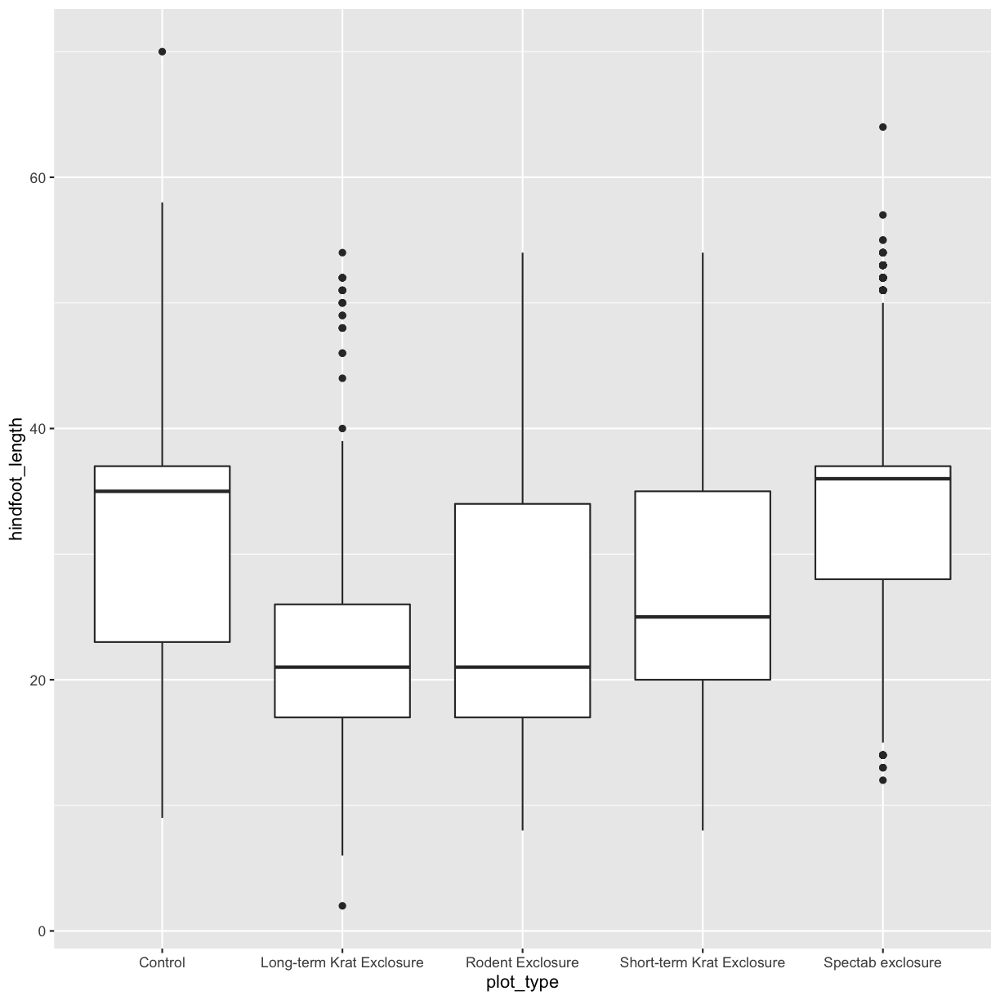

---
# Please do not edit this file directly; it is auto generated.
# Instead, please edit 04-r-text.md in _episodes_rmd/
title: "R for text data"
author: "Tobin Magle, Sarah Stevens"
teaching: 
exercises: 
questions:
- 
objectives:
- 
keypoints:
- 
source: Rmd
---


## Outline

<!--- Faceting -> factors in forcats, or dplyr::distinct -->
<!--- Clustering - there are ways to do this in R, but i’ve taught it before andit’s pretty confusing. Maybe show them how to recode with forcats instead? -->
- Reminder about what factors are
- Recoding factors 
- Reorder factors
- Joining two string vectors
- Remove leading/trailing white space
- Split - tidyr::separate <!--- Maybe? -->
<!--- Filtering - do we need to repeat this from dplyr? S: no? -->
- Sorting - dplyr::arrange <!--- Maybe? -->
<!--- Numbers + numeric facets - not sure this makes sense either, S: yeah I'm not sure what you mean here -->
- Saving - maybe reiterate write_csv

<!--- Link to slides from my first try at teaching this stuff as "data cleaning": (https://docs.google.com/presentation/d/1iZYep0u5OPQjkchEzLxYencLcQhoKYsK_3FvfzojK5c/edit#slide=id.g2a7f47f09d_1_121) -->


## Setup


~~~
library(stringr)
library(forcats)
library(ggplot2)
library(dplyr)
~~~
{: .language-r}


~~~

Attaching package: 'dplyr'
~~~
{: .output}


~~~
The following objects are masked from 'package:stats':

    filter, lag
~~~
{: .output}


~~~
The following objects are masked from 'package:base':

    intersect, setdiff, setequal, union
~~~
{: .output}


~~~
surveys <- read.csv("data/raw_surveys.csv")
~~~
{: .language-r}


## Factors

Factors are categorical vectors in R.
While some of the operations you can do on them are the same as with character vectors, others differ.
They also different in their underlying structure.
Character vectors are stored as the characters in each vector.
Factors assign a value to each category and then store the values instead of the characters for each item.
Given that this reduces the size of your data set, many functions may run faster when categories 
are set as factors instead of characters.

> ## Challenge
>
>  In the surveys data set we have read in, which columns are categories
>  and might be better typed as factors?
> 
>
> > ## Solution to Challenge
> > `plot_type`, `plot_id`, `species_id`, `genus`, `species`, and `sex` are all categorical values
> > though they are a mix of text or numeric values.  You are unlikely to want to do math on
> > the `plot_id` column despite it having numbers in it which means we may want to treat 
> > it as a factor instead. Along those same lines, the `day`, `month`, `year` columns
> > are also numeric columns which we are unlikely to do math on. While the `day` column
> > doesn't form groups as naturally, we may want to group by observations by `month` or `year`
> > which is another indicator that these might be better as factors.
> > 
> > `weight` and `hindfoot_length` are true numberic observations and so we may want to perform
> > mathematical functions on them so they can be left as integers.
> > `record_id` is unique to each row so it also doesn't form categories and would be better as
> > an integer or character vector.
> {: .solution}
{: .challenge}


## Recoding factors

One common function we may need to perform is recoding the factors.
In this case we may want to use the month names, instead of their numbers.


~~~
surveys$month_abbv <- surveys$month %>% as.factor() %>% 
  fct_recode(Jan='1', Feb='2', Mar='3', Apr='4', May='5', 
             Jun='6', Jul='7', Aug='8', Sep='9', Oct='10',
             Nov='11', Dec='12')
head(surveys)
~~~
{: .language-r}


~~~
  record_id month day year plot_id species_id sex hindfoot_length weight
1         1     7  16 1977       2         NL   M              32     NA
2        72     8  19 1977       2         NL   M              31     NA
3       224     9  13 1977       2         NL                  NA     NA
4       266    10  16 1977       2         NL                  NA     NA
5       349    11  12 1977       2         NL                  NA     NA
6       363    11  12 1977       2         NL                  NA     NA
    genus  species   taxa plot_type month_abbv
1 Neotoma albigula Rodent   Control        Jul
2 Neotoma albigula Rodent   Control        Aug
3 Neotoma albigula Rodent   Control        Sep
4 Neotoma albigula Rodent   Control        Oct
5 Neotoma albigula Rodent   Control        Nov
6 Neotoma albigula Rodent   Control        Nov
~~~
{: .output}

### Easier way to do this.

Getting the month abbreviations recoded more easily.
First let's look at the first 6 months.

~~~
surveys$month %>% head()
~~~
{: .language-r}


~~~
[1]  7  8  9 10 11 11
~~~
{: .output}

Now we can use the `month.abb[]` to get back the abbreviated names.
(Still looking at only the first 6)

~~~
month.abb[surveys$month] %>% head()
~~~
{: .language-r}


~~~
[1] "Jul" "Aug" "Sep" "Oct" "Nov" "Nov"
~~~
{: .output}

You can also do this with the full month name using `month.name[]`

~~~
month.name[surveys$month] %>% head()
~~~
{: .language-r}


~~~
[1] "July"      "August"    "September" "October"   "November"  "November" 
~~~
{: .output}

> ## Challenge
>
>  Add a new column called `month_full` onto the `surveys` data 
>  from that includes the full month name.
> 
> Hint: Check out what `month.name[]` does.
>
> > ## Solution to Challenge
> > 
> > ~~~
> > surveys$month_full <- month.name[surveys$month]
> > ~~~
> > {: .language-r}
> {: .solution}
{: .challenge}


## Reorder factors

If we use the ggplot skills we learned in the last session.
We see that the factors for `plot_type` display in the order of their 
levels, which are in alphabetical order by default.

~~~
levels(surveys$plot_type)
~~~
{: .language-r}


~~~
[1] "Control"                   "Long-term Krat Exclosure" 
[3] "Rodent Exclosure"          "Short-term Krat Exclosure"
[5] "Spectab exclosure"        
~~~
{: .output}


~~~
surveys %>% filter(!is.na(hindfoot_length)) %>% 
  ggplot(aes(x=plot_type, y=hindfoot_length)) +
  geom_boxplot()
~~~
{: .language-r}




### Control on the right

Suppose we need the control to be on the right side of our plot instead.
Before we would have to use the following code.
```
surveys$plot_type <- factor(surveys$plot_type, levels = c("Long-term Krat Exclosure", "Rodent Exclosure", "Short-term Krat Exclosure", "Spectab exclosure", "Control"))
```

Instead with the tidyverse we can use the function `fct_relevel` and specify the placement of "Control" with
`after=Inf` (after everything) instead of typing out each of the levels.


~~~
surveys$plot_type <- surveys$plot_type %>% fct_relevel("Control", after= Inf)
~~~
{: .language-r}

Now if we plot the same box plot above, the Control is the to the far right.
You can this to reorder the categories in your other plots as well.


~~~
surveys %>% 
  filter(!is.na(hindfoot_length)) %>% 
  ggplot(aes(x=plot_type, y=hindfoot_length)) +
  geom_boxplot()
~~~
{: .language-r}


> ## Challenge
>
>  1. Make a box plot of the hindfoot lenghts by `plot_id`. 
>  Hint: you may need to change the data type.
>  2. Figure out which `plot_id`'s belong to the "Control" `plot_type.  
>  Hint: You may want to the `dplyr` skills we've learned and the `unique()` function.
>  3. Reorder the `plot_id`'s in the boxplot so the control plots are on the right.
>
> > ## Solution to Challenge
> > 1. 
> > 
> > ~~~
> > surveys$plot_id <- as.factor(surveys$plot_id)
> > surveys %>% 
> >     filter(!is.na(hindfoot_length)) %>% 
> >     ggplot(aes(x=plot_id, y=hindfoot_length)) +
> >     geom_boxplot()
> > ~~~
> > {: .language-r}
> > 2. 
> > 
> > ~~~
> > ctrl_id <- surveys %>% filter(plot_type == "Control") %>% select(plot_id) %>%  unique()
> > ~~~
> > {: .language-r}
> > 3. 
> > 
> > ~~~
> > surveys$plot_id <- surveys$plot_id %>% fct_relevel('2', '17', '12', '11', '22', '14', '4', '8', after= Inf)
> > surveys %>% 
> >     filter(!is.na(hindfoot_length)) %>% 
> >     ggplot(aes(x=plot_id, y=hindfoot_length)) +
> >     geom_boxplot()
> > ~~~
> > {: .language-r}
> {: .solution}
{: .challenge}

<!--- alt challenge, reorder months in plot? 
surveys %>% filter(!is.na(weight)) %>% ggplot(aes(x=month_abbv, y=weight)) + geom_boxplot()
-->

## Make a Scientific Name column

In some of our plots we may want to label with the full scientific name.
To do so we can add a new column which joins two strings together.
Before we get into vectors lets try an example with two strings

~~~
name = "Sarah"
str_c("Hi my name is ", name)
~~~
{: .language-r}


~~~
[1] "Hi my name is Sarah"
~~~
{: .output}

We can similarly use this on vectors.


~~~
surveys$sci_name <- str_c(surveys$genus, " ",  surveys$species)
~~~
{: .language-r}

Now we could make a plot and have it labeled by the full scientific name.
Another function that you could have used here is `paste()`

## Remove leading/trailing whitespace

For this example, let's read in a messy version of the data.
Conveniently, there are some white space issues in the first few entries of `scientificName`.
Let's take a look.


~~~
messy_surveys <- read.csv("data/Portal_rodents_19772002_scinameUUIDs.csv")
head(messy_surveys)
~~~
{: .language-r}


~~~
                             survey_id recordID mo dy   yr period
1 491ec41b-0a80-4ce9-b754-2983c6f38e71     6545  9 18 1982     62
2 f280bade-4e9b-447d-afe0-9e6d45e6bfb0     5220  1 24 1982     54
3 2b1b4a8a-c3e9-4781-a5f9-18b081383876    18932  8  7 1991    162
4 e98e66c4-514b-45f7-9d95-336c05a72b21    20588  1 24 1993    179
5 768cdd0d-93bc-4c74-9dcd-d1ed48b7501e     7020 11 21 1982     63
6 13851c71-013d-4989-bd49-7d7a65af7709     7645  4 16 1983     67
                               plot_id plot note1 stake species
1 4dc16022-f28d-4b9d-9062-c7bc3ad43362   13    13    36      AB
2 dcbbd373-c22e-46ef-ae8b-ad88f5cf7475   20    13    27      AB
3 1e87b11b-4795-4f41-bdff-2d5c4412be25   19    13    33      AS
4 91829d58-c12e-47e8-ae31-185f46be21d2   12    13    41      AS
5 f24f2db6-eadd-4de9-9d2f-95aea376c013   24    13    72      AH
6 f24f2db6-eadd-4de9-9d2f-95aea376c013   24    13    21      AH
            scientificName
1     Amphispiza bilineata
2   Amphispiza bilineata  
3    Ammodramus savannarum
4    Ammodramus savannarum
5 Ammospermophilis harrisi
6 Ammospermophilus harrisi
                                                                                                                                                         locality
1                                                                                                                                    Winterthur Gardens, Delaware
2                                                                                                                                    Winterthur Gardens, Delaware
3 FL; Highlands Co.; near parking area and nature trail at Archbold Biological Research Station, ca. 6 air mi S of Lake Placid. T38S, R30E, SE1/4 of SE1/4 Sec 7.
4                                                                                                                      Swampy woodland, 2 miles E of Tallahassee.
5                                                                                                                               Muscogee-Rerdido [Perdido] River.
6                                                                                                                                              near Lake Lindsey.
                                                                                                                                                                                                                                                                                                                                                                                                                                                                                                                                                                                                                                                                                                                                                                                                                                                                                                                                                                                                                                                                                                                                                                                                                                                                                                                                                                                                                                                                                                                                                                                                                                JSON
1                                                                                                                                                                                                                                                                                                                                                                                                                                                                                                                                                                                                                                                                                                                                                                                                                                                                                                                                                                                                                                                                                                                                                                                                                                                                                                                                                                                                                                                                                                                                                                                                                                   
2                                                                                                                                                                                                                                                                                                                                                                                                                                                                                                                                                                                                                                                                                                                                                                                                                                                                                                                                                                                                                                                                                                                                                                                                                                                                                                                                                                                                                                                                                                                                                                                                                                   
3                                                                                                                                                                                                                                                                                                                                                                                                                                                                                                                                                                                                                                                                                                                                                                                                                                                                                                                                                                                                                                                                                                                                                                                                                                                                                                                                                                                                                                                                                                                                                                                                                                   
4                                                                                                                                                                                                                                                                                                                                                                                                                                                                                                                                                                                                                                                                                                                                                                                                                                                                                             {\n"engineVersion" : "GLC:4.94|U:1.01374|eng:1.0",\n"numResults" : 1,\n"executionTimems" : 1248.0022,\n"resultSet" : { "type": "FeatureCollection",\n"features": [\n{ "type": "Feature",\n"geometry": {"type": "Point", "coordinates": [-84.247155, 30.438056]},\n"properties": {\n"parsePattern" : "Distance East of TALLAHASSEE",\n"precision" : "High",\n"score" : 86,\n"uncertaintyRadiusMeters" : 20330,\n"uncertaintyPolygon" : "Unavailable",\n"displacedDistanceMiles" : 2,\n"displacedHeadingDegrees" : 90,\n"debug" : ":GazPartMatch=False|:inAdm=True|:Adm=LEON|:orig_d=2 MI|:NPExtent=29301|:NP=TALLAHASSEE|:KFID=FL:ppl:4006|TALLAHASSEE"\n}\n}\n ],\n"crs": { "type" : "EPSG", "properties" : { "code" : 4326 }}\n}\n}\n
5                                                                                                                                                                                                                                                                                                                                                                                                                                                                                              {\n"engineVersion" : "GLC:4.94|U:1.01374|eng:1.0",\n"numResults" : 2,\n"executionTimems" : 187.2004,\n"resultSet" : { "type": "FeatureCollection",\n"features": [\n{ "type": "Feature",\n"geometry": {"type": "Point", "coordinates": [-87.38167, 30.44972]},\n"properties": {\n"parsePattern" : "PERDIDO RIVER",\n"precision" : "Low",\n"score" : 43,\n"uncertaintyRadiusMeters" : 210,\n"uncertaintyPolygon" : "Unavailable",\n"displacedDistanceMiles" : 0,\n"displacedHeadingDegrees" : 0,\n"debug" : ":GazPartMatch=False|:inAdm=True|:Adm=ESCAMBIA|:NPExtent=350|:NP=PERDIDO RIVER|:KFID=|PERDIDO RIVER"\n}\n},\n{ "type": "Feature",\n"geometry": {"type": "Point", "coordinates": [-87.39667, 30.60556]},\n"properties": {\n"parsePattern" : "MUSCOGEE",\n"precision" : "Low",\n"score" : 38,\n"uncertaintyRadiusMeters" : 3036,\n"uncertaintyPolygon" : "Unavailable",\n"displacedDistanceMiles" : 0,\n"displacedHeadingDegrees" : 0,\n"debug" : ":GazPartMatch=False|:inAdm=True|:Adm=ESCAMBIA|:NPExtent=5040|:NP=MUSCOGEE|:KFID=|MUSCOGEE"\n}\n}\n ],\n"crs": { "type" : "EPSG", "properties" : { "code" : 4326 }}\n}\n}\n
6 {\n"engineVersion" : "GLC:4.94|U:1.01374|eng:1.0",\n"numResults" : 3,\n"executionTimems" : 156.0003,\n"resultSet" : { "type": "FeatureCollection",\n"features": [\n{ "type": "Feature",\n"geometry": {"type": "Point", "coordinates": [-82.35944, 28.63444]},\n"properties": {\n"parsePattern" : "Near LAKE LINDSEY",\n"precision" : "Medium",\n"score" : 57,\n"uncertaintyRadiusMeters" : 3036,\n"uncertaintyPolygon" : "Unavailable",\n"displacedDistanceMiles" : 0,\n"displacedHeadingDegrees" : 0,\n"debug" : ":GazPartMatch=False|:inAdm=True|:Adm=HERNANDO|:NPExtent=5040|:NP=LAKE LINDSEY|:KFID=|LAKE LINDSEY"\n}\n},\n{ "type": "Feature",\n"geometry": {"type": "Point", "coordinates": [-82.36194, 28.63417]},\n"properties": {\n"parsePattern" : "Near LAKE LINDSEY",\n"precision" : "Medium",\n"score" : 57,\n"uncertaintyRadiusMeters" : 240,\n"uncertaintyPolygon" : "Unavailable",\n"displacedDistanceMiles" : 0,\n"displacedHeadingDegrees" : 0,\n"debug" : ":GazPartMatch=False|:inAdm=True|:Adm=HERNANDO|:NPExtent=400|:NP=LAKE LINDSEY|:KFID=FL:ppl:3654|LAKE LINDSEY"\n}\n},\n{ "type": "Feature",\n"geometry": {"type": "Point", "coordinates": [-82.36583, 28.63028]},\n"properties": {\n"parsePattern" : "Near LAKE LINDSEY",\n"precision" : "Medium",\n"score" : 57,\n"uncertaintyRadiusMeters" : 587,\n"uncertaintyPolygon" : "Unavailable",\n"displacedDistanceMiles" : 0,\n"displacedHeadingDegrees" : 0,\n"debug" : ":GazPartMatch=False|:inAdm=True|:Adm=HERNANDO|:NPExtent=975|:NP=LAKE LINDSEY|:KFID=|LAKE LINDSEY"\n}\n}\n ],\n"crs": { "type" : "EPSG", "properties" : { "code" : 4326 }}\n}\n}\n
  decimalLatitude decimalLongitude   county   state
1              NA               NA     NULL    NULL
2              NA               NA     NULL    NULL
3              NA               NA     NULL    NULL
4        30.43806        -84.24716     Leon Florida
5        30.44972        -87.38167 Escambia Florida
6        28.63444        -82.35944 Hernando Florida
                   country sex age reprod testes vagina pregnant nipples
1            UNITED STATES                                              
2            UNITED STATES                                              
3            UNITED STATES                                              
4 United States of America                                              
5 United States of America                                              
6 United States of America                                              
  lactation hfl wgt tag note2 ltag note3 prevrt prevlet nestdir neststk
1            NA  NA                                  NA              NA
2            NA  NA                                  NA              NA
3            NA  NA                                  NA              NA
4            NA  NA                                  NA              NA
5            NA  NA                                  NA              NA
6            NA  NA                                  NA              NA
  note4 note5
1            
2            
3           D
4            
5            
6            
~~~
{: .output}


~~~
messy_surveys$scientificName %>% head()
~~~
{: .language-r}


~~~
[1]   Amphispiza bilineata     Amphispiza bilineata  
[3] Ammodramus savannarum    Ammodramus savannarum   
[5] Ammospermophilis harrisi Ammospermophilus harrisi
29 Levels:    Amphispiza bilineata ... Onychomys\xa0sp.
~~~
{: .output}

The spacing here shows us that there is probably something.  It is a little easier
to see if we view it as a character vector instead of a factor in this case.


~~~
messy_surveys$scientificName %>% as.character() %>% head()
~~~
{: .language-r}


~~~
[1] "  Amphispiza bilineata"   "  Amphispiza bilineata  "
[3] "Ammodramus savannarum"    "Ammodramus savannarum"   
[5] "Ammospermophilis harrisi" "Ammospermophilus harrisi"
~~~
{: .output}

Now we can see that there are both leading and trailing spaces in these first view entries.
We can use `str_trim()` to trim off white space.  It takes two arguments, the character vector
and `side` which indicates which side we want to trim.  We will use "both" since we have both
leading and trailing white space.


~~~
messy_surveys$scientificName %>% str_trim(side="both") %>% head()
~~~
{: .language-r}


~~~
[1] "Amphispiza bilineata"     "Amphispiza bilineata"    
[3] "Ammodramus savannarum"    "Ammodramus savannarum"   
[5] "Ammospermophilis harrisi" "Ammospermophilus harrisi"
~~~
{: .output}

Let's replace this column in our messy data set to clean it up a little.
Note we don't want to use `head()` this time.


~~~
messy_surveys$scientificName <- messy_surveys$scientificName %>% str_trim(side="both")
~~~
{: .language-r}


## Regular expressions


## Left pad the months, for data consistency

In the past we've seen cases where sorting on number characters/factors 
can behave differently than expected.
If we want to avoid this we can add zero's on the left side and make our numbers
a consistent length.


~~~
samp_ids <- c("1", "10", "100", "200")
~~~
{: .language-r}

First we should look up the arguments for `str_pad` the function we need to use.

From the help we can see that we need the character vector, and the following 
additional arguments: `width`, `side`, and `pad`.


~~~
str_pad(samp_ids, width = 3, side = "left", pad="0")
~~~
{: .language-r}


~~~
[1] "001" "010" "100" "200"
~~~
{: .output}

Now we can try this on our data set.


~~~
surveys$month <- surveys$month %>% 
  str_pad(width = 2, side = "left", pad='0')
head(surveys)
~~~
{: .language-r}


~~~
  record_id month day year plot_id species_id sex hindfoot_length weight
1         1    07  16 1977       2         NL   M              32     NA
2        72    08  19 1977       2         NL   M              31     NA
3       224    09  13 1977       2         NL                  NA     NA
4       266    10  16 1977       2         NL                  NA     NA
5       349    11  12 1977       2         NL                  NA     NA
6       363    11  12 1977       2         NL                  NA     NA
    genus  species   taxa plot_type month_abbv         sci_name
1 Neotoma albigula Rodent   Control        Jul Neotoma albigula
2 Neotoma albigula Rodent   Control        Aug Neotoma albigula
3 Neotoma albigula Rodent   Control        Sep Neotoma albigula
4 Neotoma albigula Rodent   Control        Oct Neotoma albigula
5 Neotoma albigula Rodent   Control        Nov Neotoma albigula
6 Neotoma albigula Rodent   Control        Nov Neotoma albigula
~~~
{: .output}

> ## Challenge
>
>  Try the same thing with the `day` column.
> 
>
> > ## Solution to Challenge
> > 
> > ~~~
> >  surveys$day <- surveys$day %>% 
> >   str_pad(width = 2, side = "left", pad='0')
> > ~~~
> > {: .language-r}
> {: .solution}
{: .challenge}


## Write back to a csv file


