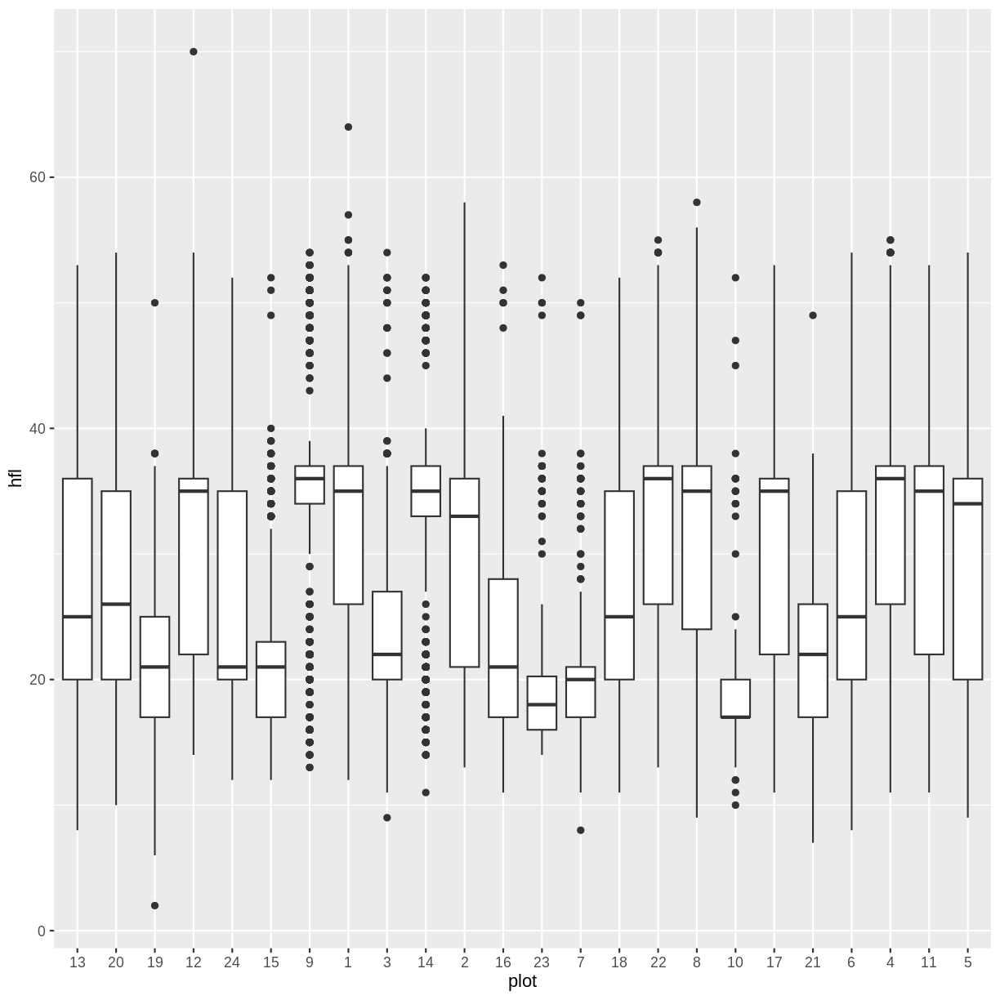
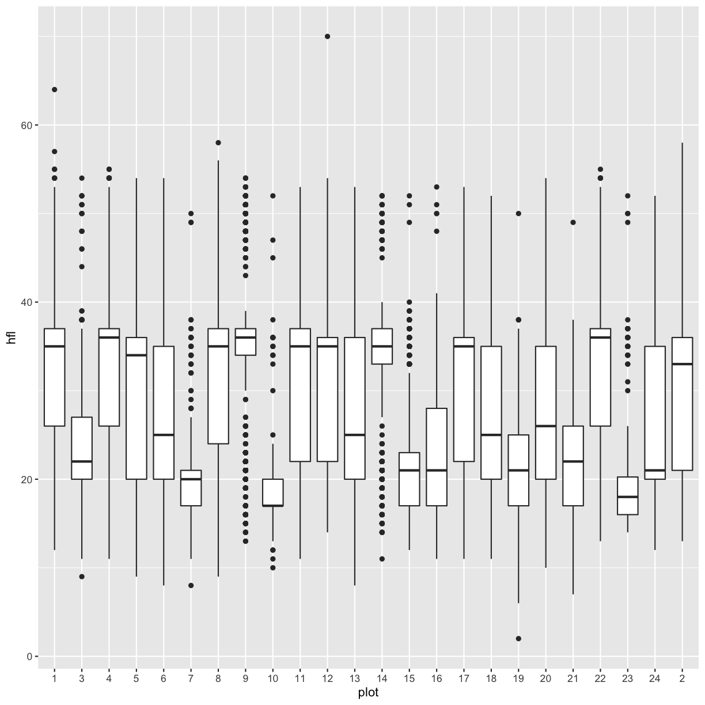
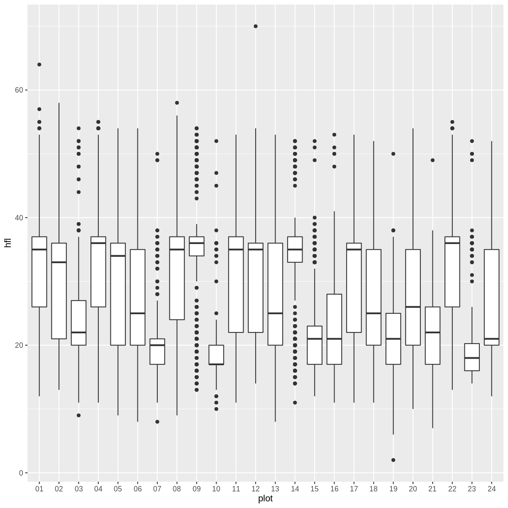

---
# Please do not edit this file directly; it is auto generated.
# Instead, please edit 04-r-text.md in _episodes_rmd/
title: "R for text data"
teaching: FIXME
exercises: FIXME
questions:
- FIXME
objectives:
- FIXME
keypoints:
- FIXME
source: Rmd
---


<!--- Link to slides from Tobin's first try at teaching this stuff as "data cleaning": (https://docs.google.com/presentation/d/1iZYep0u5OPQjkchEzLxYencLcQhoKYsK_3FvfzojK5c/edit#slide=id.g2a7f47f09d_1_121) -->

## Why do this in R?
- Data is rarely clean and tidy
- Misspellings
- White space
- Multiple variables per column
- Inconsistent coding
- Fixing it by hand takes forever

## Types of text data
Up until now, we've largely treated all text data the same as either all factors or all strings.
However, the type of a text column in a tibble determines what you can do with the data.
If you want to clean up misspellings or look for patterns in unstructured data, you can do that 
in a string column. If you want to subset based on a catagory or combine categories, factors are more useful.

This lesson will cover packages that make working with text data easier: `stringr` and `forcats`.
These packages are part of the `tidyverse`, meaning that they work well with `dplyr`, specifically
the `mutate` function. We will also cover options in the `read_csv` function that will allow you to
choose what type the data are when they are imported.

## Download Data

[Link to download the data](https://go.wisc.edu/968tj7)
<!--- You shoud zip this at least! -->

## Factors

Factors are categorical vectors in R.
While some of the operations you can do on them are the same as with character vectors, others differ.
They also different in their underlying structure.
Character vectors are stored as the characters in each vector.
Factors assign a value to each category and then store the values instead of the characters for each item.
Given that this reduces the size of your data set, many functions may run faster when categories 
are set as factors instead of characters.

## The data

We will be using a messier version of the surveys data that were used in the dplyr and ggplot2 lessons. 

## Importing the data

Let's start by loading the libraries and importing the data with `read_csv`.

~~~
library(tidyverse)
# OR
library(stringr)
library(forcats)
library(ggplot2)
library(dplyr)
library(readr)
library(tidyr)

surveys<-read_csv(file = "data/Portal_rodents_19772002_scinameUUIDs.csv")
~~~
{: .language-r}


~~~

── Column specification ────────────────────────────────────────────────────────
cols(
  .default = col_character(),
  recordID = col_double(),
  mo = col_double(),
  dy = col_double(),
  yr = col_double(),
  period = col_double(),
  plot = col_double(),
  note1 = col_double(),
  stake = col_double(),
  decimalLatitude = col_double(),
  decimalLongitude = col_double(),
  hfl = col_double(),
  wgt = col_double(),
  ltag = col_double(),
  note3 = col_logical(),
  prevrt = col_double(),
  prevlet = col_double(),
  neststk = col_double(),
  note4 = col_logical()
)
ℹ Use `spec()` for the full column specifications.
~~~
{: .output}


~~~
Warning: 674 parsing failures.
 row   col           expected actual                                            file
1039 note4 1/0/T/F/TRUE/FALSE     TE 'data/Portal_rodents_19772002_scinameUUIDs.csv'
1070 note4 1/0/T/F/TRUE/FALSE     TA 'data/Portal_rodents_19772002_scinameUUIDs.csv'
1092 note4 1/0/T/F/TRUE/FALSE     TE 'data/Portal_rodents_19772002_scinameUUIDs.csv'
1099 note4 1/0/T/F/TRUE/FALSE     TE 'data/Portal_rodents_19772002_scinameUUIDs.csv'
1110 note4 1/0/T/F/TRUE/FALSE     TE 'data/Portal_rodents_19772002_scinameUUIDs.csv'
.... ..... .................. ...... ...............................................
See problems(...) for more details.
~~~
{: .warning}

Note that there are a few parsing errors. This error happens becaues `read_csv`
looks at the first 1000 rows of each column and guess which type that column
should be based on those entries.  In our case there are a few entries at the
bottom of the notes columns which don't fit the type it guessed based on the first
1000 rows.  We will add the `guess_max` argument to have `read_csv` check the 
whole column before it automatically chooses a type for that column.


~~~
surveys <- read_csv(file = "data/Portal_rodents_19772002_scinameUUIDs.csv", 
                  guess_max = 40000)
~~~
{: .language-r}


~~~

── Column specification ────────────────────────────────────────────────────────
cols(
  .default = col_character(),
  recordID = col_double(),
  mo = col_double(),
  dy = col_double(),
  yr = col_double(),
  period = col_double(),
  plot = col_double(),
  note1 = col_double(),
  stake = col_double(),
  decimalLatitude = col_double(),
  decimalLongitude = col_double(),
  hfl = col_double(),
  wgt = col_double(),
  prevlet = col_double(),
  neststk = col_double()
)
ℹ Use `spec()` for the full column specifications.
~~~
{: .output}

Because we imported the data using `read_csv`, all of the non-numeric columns were converted to the 
`character` class. If we used `read.csv`, they would all be factors.

> ## Challenge 1
> Look at the data columns in the surveys dataset. Which columns should be 
> converted to factors? Which should stay as text? Why?
> 
> Hint: should any numeric columns be factors?
> 
> > ## Solution to Challenge 1
> > 
> > 
> > 
> {: .solution}
{: .challenge}

<!---
> ## Challenge
>
>  In the surveys data set we have read in, which columns are categories
>  and might be better typed as factors?
> 
>
> > ## Solution to Challenge
> > `plot_type`, `plot_id`, `species_id`, `genus`, `species`, and `sex` are all categorical values
> > though they are a mix of text or numeric values.  You are unlikely to want to do math on
> > the `plot_id` column despite it having numbers in it which means we may want to treat 
> > it as a factor instead. Along those same lines, the `day`, `month`, `year` columns
> > are also numeric columns which we are unlikely to do math on. While the `day` column
> > doesn't form groups as naturally, we may want to group by observations by `month` or `year`
> > which is another indicator that these might be better as factors.
> > 
> > `weight` and `hindfoot_length` are true numberic observations and so we may want to perform
> > mathematical functions on them so they can be left as integers.
> > `record_id` is unique to each row so it also doesn't form categories and would be better as
> > an integer or character vector.
> {: .solution}
{: .challenge}
-->

## Changing column classes


~~~
#Create a text vector
species<-c("AB", "AS", "AS", "AB")
class(species)
~~~
{: .language-r}


~~~
[1] "character"
~~~
{: .output}


~~~
#convert it to factor
species<-as_factor(species)
species
~~~
{: .language-r}


~~~
[1] AB AS AS AB
Levels: AB AS
~~~
{: .output}


~~~
class(species)
~~~
{: .language-r}


~~~
[1] "factor"
~~~
{: .output}


~~~
#convert back to character
species<-as.character(species) 
class(species)
~~~
{: .language-r}


~~~
[1] "character"
~~~
{: .output}


~~~
surveys<- surveys%>%
  mutate(species = as_factor(species))
~~~
{: .language-r}
OR


~~~
surveys$scientificName <- as_factor(surveys$scientificName)
~~~
{: .language-r}

Or, you could specify the types of all of your columns upon reading.


~~~
surveys<-read_csv(file = "data/Portal_rodents_19772002_scinameUUIDs.csv",
                  col_types = cols(col_character(), #survey_id
                                col_character(), #recordID
                                col_integer(),    #Month
                                col_integer(),    #day
                                col_integer(),    #year
                                col_double(),    #period
                                col_factor(), #plot_id
                                col_factor(), #plot
                                col_character(), #note1
                                col_character(), #stake
                                col_factor(), #species
                                col_factor(), #scientificName
                                col_character(), #locality
                                col_character(), #JSON
                                col_double(), #decimalLatitude
                                col_double(), #decimalLongitude
                                col_factor(), #county
                                col_factor(), #state
                                col_factor(), #country
                                col_factor(), #sex
                                col_factor(), #age
                                col_character(), #reprod
                                col_character(), #testes
                                col_character(), #vagina
                                col_character(), #pregnant
                                col_character(), #nippples
                                col_character(), #lactation
                                col_double(), #hfl
                                col_double(), #wgt
                                col_character(), #tag
                                col_character(), #note2
                                col_character(), #ltag
                                col_character(), #note3
                                col_character(), #prevrt
                                col_integer(), #prevlet
                                col_character(), #nestdir
                                col_integer(), #neststk
                                col_character(), #note4
                                col_character() #note5
                                )
                  )
~~~
{: .language-r}

> ## Challenge 2
> Convert the columns you identified in Challenge 1 to factors
> 
> > ## Solution to Challenge 2
> > 
> > 
> > 
> {: .solution}
{: .challenge}


## Fun with Factors

- Recoding factors, `fct_recode()`
- Reordering factors, `fct_relevel()`


### Recoding factors

One common function we may need to perform is recoding the factors.
In this case we may want to use the month names, instead of their numbers.


~~~
surveys$mo_abbv <- surveys$mo %>% as.factor() %>% 
  fct_recode(Jan='1', Feb='2', Mar='3', Apr='4', May='5', 
             Jun='6', Jul='7', Aug='8', Sep='9', Oct='10',
             Nov='11', Dec='12')
head(surveys)
~~~
{: .language-r}


~~~
# A tibble: 6 x 40
  survey_id  recordID    mo    dy    yr period plot_id plot  note1 stake species
  <chr>      <chr>    <int> <int> <int>  <dbl> <fct>   <fct> <chr> <chr> <fct>  
1 491ec41b-… 6545         9    18  1982     62 4dc160… 13    13    36    AB     
2 f280bade-… 5220         1    24  1982     54 dcbbd3… 20    13    27    AB     
3 2b1b4a8a-… 18932        8     7  1991    162 1e87b1… 19    13    33    AS     
4 e98e66c4-… 20588        1    24  1993    179 91829d… 12    13    41    AS     
5 768cdd0d-… 7020        11    21  1982     63 f24f2d… 24    13    72    AH     
6 13851c71-… 7645         4    16  1983     67 f24f2d… 24    13    21    AH     
# … with 29 more variables: scientificName <fct>, locality <chr>, JSON <chr>,
#   decimalLatitude <dbl>, decimalLongitude <dbl>, county <fct>, state <fct>,
#   country <fct>, sex <fct>, age <fct>, reprod <chr>, testes <chr>,
#   vagina <chr>, pregnant <chr>, nipples <chr>, lactation <chr>, hfl <dbl>,
#   wgt <dbl>, tag <chr>, note2 <chr>, ltag <chr>, note3 <chr>, prevrt <chr>,
#   prevlet <int>, nestdir <chr>, neststk <int>, note4 <chr>, note5 <chr>,
#   mo_abbv <fct>
~~~
{: .output}

#### Easier way to do this.

Getting the month abbreviations recoded more easily.
First let's look at the first 6 months.


~~~
surveys$mo %>% head()
~~~
{: .language-r}


~~~
[1]  9  1  8  1 11  4
~~~
{: .output}

Now we can use the `month.abb[]` to get back the abbreviated names.
(Still looking at only the first 6)

~~~
month.abb[surveys$mo] %>% head()
~~~
{: .language-r}


~~~
[1] "Sep" "Jan" "Aug" "Jan" "Nov" "Apr"
~~~
{: .output}


> ## Challenge
>
>  Add a new column called `mo_full` onto the `surveys` data 
>  from that includes the full month name.
> 
> Shortcut hint: Check out what `month.name[]` does.
>
> > ## Solution to Challenge
> > 
> > ~~~
> > surveys$mo_full <- surveys$mo %>% as.factor() %>% 
> >   fct_recode(January='1', Febuary='2', March='3', April='4', May='5', 
> >              June='6', July='7', August='8', September='9', October='10',
> >              November='11', December='12')
> > ~~~
> > {: .language-r}
> > OR
> > 
> > ~~~
> > surveys$mo_full <- month.name[surveys$mo]
> > ~~~
> > {: .language-r}
> {: .solution}
{: .challenge}


### Reorder factors

If we use the ggplot skills we learned in the last session.
We see that the factors for `plot_type` display in the order of their 
levels, which are in alphabetical order by default.


~~~
levels(surveys$plot)
~~~
{: .language-r}


~~~
 [1] "13" "20" "19" "12" "24" "15" "9"  "1"  "3"  "14" "2"  "16" "23" "7"  "18"
[16] "22" "8"  "10" "17" "21" "6"  "4"  "11" "5" 
~~~
{: .output}


~~~
surveys %>% filter(!is.na(hfl)) %>% 
  ggplot(aes(x=plot, y=hfl)) +
  geom_boxplot()
~~~
{: .language-r}



#### Ordered by number and left pad

Let's put the plots in order by their number using the `fct_relevel` function.


~~~
surveys$plot %>% 
  levels() %>% 
  sort()
~~~
{: .language-r}


~~~
 [1] "1"  "10" "11" "12" "13" "14" "15" "16" "17" "18" "19" "2"  "20" "21" "22"
[16] "23" "24" "3"  "4"  "5"  "6"  "7"  "8"  "9" 
~~~
{: .output}
This sort is sorting alphabetically and by place. To fix the sorting, we can 
add a leading zero and 'left pad' the names using a string method. 


~~~
str_pad(surveys$plot, width = 2, side = "left", pad="0") %>% head(10)
~~~
{: .language-r}


~~~
 [1] "13" "20" "19" "12" "24" "24" "15" "09" "15" "13"
~~~
{: .output}


~~~
surveys$plot <- str_pad(surveys$plot, width = 2, side = "left", pad="0") %>% as_factor()
order <- surveys$plot %>% 
  levels() %>%
  sort() 
surveys$plot <- fct_relevel(surveys$plot, order)
levels(surveys$plot)
~~~
{: .language-r}


~~~
 [1] "01" "02" "03" "04" "05" "06" "07" "08" "09" "10" "11" "12" "13" "14" "15"
[16] "16" "17" "18" "19" "20" "21" "22" "23" "24"
~~~
{: .output}


~~~
surveys %>% filter(!is.na(hfl)) %>% 
  ggplot(aes(x=plot, y=hfl)) +
  geom_boxplot()
~~~
{: .language-r}




We can also reorder only a subset of the levels without having to specify 
all of the levels by using the `after=` argument
We can say 1 (after the first level) to Inf (after everything) instead of
typing out each of the levels in order.

We know from other information that the levels 
'2', '4', '8', '11', '12', '17', '22' are the control plots.
Let's try putting the level '2' at the end so we can see all
the controls to the right.


~~~
surveys$plot <- surveys$plot %>% fct_relevel('2', after= Inf)
~~~
{: .language-r}


~~~
Warning: Unknown levels in `f`: 2
~~~
{: .warning}

Now if we plot the same box plot above, plot 2 is now on the far right.
You can this to reorder the categories in other plots as well.


~~~
surveys %>% 
  filter(!is.na(hfl)) %>% 
  ggplot(aes(x=plot, y=hfl)) +
  geom_boxplot()
~~~
{: .language-r}



> ## Challenge
>
>  Reorder the `plot`'s in the boxplot above so all the control plots 
>  are on the right.
>
> > ## Solution to Challenge
> > 
> > ~~~
> > surveys$plot<- surveys$plot %>% fct_relevel('2', '4', '8', '11', '12', '17', '22', after= Inf)
> > surveys %>% 
> >     filter(!is.na(hfl)) %>% 
> >     ggplot(aes(x=plot, y=hfl)) +
> >     geom_boxplot()
> > ~~~
> > {: .language-r}
> {: .solution}
{: .challenge}

<!--- alt challenge, reorder months in plot? 
surveys %>% filter(!is.na(wgt)) %>% ggplot(aes(x=mo_abbv, y=wgt)) + geom_boxplot()
-->


## Cleaning up text data

When text data is entered by hand, small differences can be introduced that 
aren't easy to see with the human eye, but are important to the computer. 
One easy way to identify these small differences is the `count` function.


~~~
surveys%>%
  count(scientificName)
~~~
{: .language-r}


~~~
# A tibble: 27 x 2
   scientificName                n
   <fct>                     <int>
 1 Amphispiza bilineata        291
 2 Ammodramus savannarum         2
 3 Ammospermophilis harrisi      1
 4 Ammospermophilus harrisi    435
 5 Ammospermophilus harrisii     1
 6 Amphespiza bilineata          7
 7 Amphispiza bilineatus         1
 8 Amphispiza cilineata          1
 9 Amphispizo bilineata          1
10 Baiomys taylori              46
# … with 17 more rows
~~~
{: .output}


You can see some very similar species names, for example: 
"Ammospermophilis harrisi", "Ammospermophilus harrisi", "Ammospermophilus harrisii". 
However one spelling has many more records than the others. How can we fix the spellings?


~~~
surveys$scientificName <- fct_explicit_na(surveys$scientificName)
surveys$scientificName <- fct_collapse(surveys$scientificName,
            "Ammospermophilus harrisi"=c("Ammospermophilus harrisi",
                                         "Ammospermophilis harrisi",
                                         "Ammospermophilus harrisii"),
            "Amphespiza bilineata" = c("Amphispiza bilineatus",
                                       "Amphispiza cilineata",
                                       "Amphispizo bilineata"))
~~~
{: .language-r}

We can see the change by looking at the count again.


~~~
surveys%>%
  count(scientificName)
~~~
{: .language-r}


~~~
# A tibble: 22 x 2
   scientificName                      n
   <fct>                           <int>
 1 Amphispiza bilineata              291
 2 Ammodramus savannarum               2
 3 Ammospermophilus harrisi          437
 4 Amphespiza bilineata               10
 5 Baiomys taylori                    46
 6 Calamospiza melanocorys             1
 7 Callipepla squamata                 1
 8 Campylorhynchus brunneicapillus     1
 9 Chaetodipus baileyi                 2
10 Cnemidophorus tigris                1
# … with 12 more rows
~~~
{: .output}


> ## Challenge
>
>  1. Find all the possible variants on the country name "United States""
>  2. Change them all to the most common variant.
>
> > ## Solution to Challenge
> > 
> > ~~~
> > surveys %>% count(country)
> > # We can see that "United States of America", "UNITED STATES", and "US"
> > # Are possible options with "UNITED STATES" being the most common.
> > surveys$country <- fct_collapse(surveys$country, 
> >              "UNITED STATES" = c("United States of America",
> >                                  "US"))
> > ~~~
> > {: .language-r}
> {: .solution}
{: .challenge}


## Splitting Variables

Next we may want to split the scientific names into genus and species columns
as we have seen in the cleaned version of the data.


~~~
surveys <- separate(surveys, scientificName, c("genusName", "speciesName"), sep="\\s", remove = FALSE)
~~~
{: .language-r}


~~~
Warning in gregexpr(pattern, x, perl = TRUE): PCRE error
	'UTF-8 error: isolated byte with 0x80 bit set'
	for element 16923
~~~
{: .warning}


~~~
Warning in gregexpr(pattern, x, perl = TRUE): PCRE error
	'UTF-8 error: isolated byte with 0x80 bit set'
	for element 16924
~~~
{: .warning}


~~~
Warning in gregexpr(pattern, x, perl = TRUE): PCRE error
	'UTF-8 error: isolated byte with 0x80 bit set'
	for element 16925
~~~
{: .warning}


~~~
Warning in gregexpr(pattern, x, perl = TRUE): PCRE error
	'UTF-8 error: isolated byte with 0x80 bit set'
	for element 16926
~~~
{: .warning}


~~~
Warning in gregexpr(pattern, x, perl = TRUE): PCRE error
	'UTF-8 error: isolated byte with 0x80 bit set'
	for element 16927
~~~
{: .warning}


~~~
Warning in gregexpr(pattern, x, perl = TRUE): PCRE error
	'UTF-8 error: isolated byte with 0x80 bit set'
	for element 16928
~~~
{: .warning}


~~~
Warning in gregexpr(pattern, x, perl = TRUE): PCRE error
	'UTF-8 error: isolated byte with 0x80 bit set'
	for element 16929
~~~
{: .warning}


~~~
Warning in gregexpr(pattern, x, perl = TRUE): PCRE error
	'UTF-8 error: isolated byte with 0x80 bit set'
	for element 16930
~~~
{: .warning}


~~~
Warning in gregexpr(pattern, x, perl = TRUE): PCRE error
	'UTF-8 error: isolated byte with 0x80 bit set'
	for element 16931
~~~
{: .warning}


~~~
Warning in gregexpr(pattern, x, perl = TRUE): PCRE error
	'UTF-8 error: isolated byte with 0x80 bit set'
	for element 16932
~~~
{: .warning}


~~~
Warning in gregexpr(pattern, x, perl = TRUE): PCRE error
	'UTF-8 error: isolated byte with 0x80 bit set'
	for element 16933
~~~
{: .warning}


~~~
Warning in gregexpr(pattern, x, perl = TRUE): PCRE error
	'UTF-8 error: isolated byte with 0x80 bit set'
	for element 16934
~~~
{: .warning}


~~~
Warning in gregexpr(pattern, x, perl = TRUE): PCRE error
	'UTF-8 error: isolated byte with 0x80 bit set'
	for element 16935
~~~
{: .warning}


~~~
Warning in gregexpr(pattern, x, perl = TRUE): PCRE error
	'UTF-8 error: isolated byte with 0x80 bit set'
	for element 16936
~~~
{: .warning}


~~~
Warning in gregexpr(pattern, x, perl = TRUE): PCRE error
	'UTF-8 error: isolated byte with 0x80 bit set'
	for element 16937
~~~
{: .warning}


~~~
Warning in gregexpr(pattern, x, perl = TRUE): PCRE error
	'UTF-8 error: isolated byte with 0x80 bit set'
	for element 16938
~~~
{: .warning}


~~~
Warning in gregexpr(pattern, x, perl = TRUE): PCRE error
	'UTF-8 error: isolated byte with 0x80 bit set'
	for element 16939
~~~
{: .warning}


~~~
Warning in gregexpr(pattern, x, perl = TRUE): PCRE error
	'UTF-8 error: isolated byte with 0x80 bit set'
	for element 16940
~~~
{: .warning}


~~~
Warning in gregexpr(pattern, x, perl = TRUE): PCRE error
	'UTF-8 error: isolated byte with 0x80 bit set'
	for element 16941
~~~
{: .warning}


~~~
Warning in gregexpr(pattern, x, perl = TRUE): PCRE error
	'UTF-8 error: isolated byte with 0x80 bit set'
	for element 16942
~~~
{: .warning}


~~~
Warning in gregexpr(pattern, x, perl = TRUE): PCRE error
	'UTF-8 error: isolated byte with 0x80 bit set'
	for element 16943
~~~
{: .warning}


~~~
Warning in gregexpr(pattern, x, perl = TRUE): PCRE error
	'UTF-8 error: isolated byte with 0x80 bit set'
	for element 16944
~~~
{: .warning}


~~~
Warning in gregexpr(pattern, x, perl = TRUE): PCRE error
	'UTF-8 error: isolated byte with 0x80 bit set'
	for element 16945
~~~
{: .warning}


~~~
Warning in gregexpr(pattern, x, perl = TRUE): PCRE error
	'UTF-8 error: isolated byte with 0x80 bit set'
	for element 16946
~~~
{: .warning}


~~~
Warning in gregexpr(pattern, x, perl = TRUE): PCRE error
	'UTF-8 error: isolated byte with 0x80 bit set'
	for element 16947
~~~
{: .warning}


~~~
Warning in gregexpr(pattern, x, perl = TRUE): PCRE error
	'UTF-8 error: isolated byte with 0x80 bit set'
	for element 16948
~~~
{: .warning}


~~~
Warning in gregexpr(pattern, x, perl = TRUE): PCRE error
	'UTF-8 error: isolated byte with 0x80 bit set'
	for element 16949
~~~
{: .warning}


~~~
Warning in gregexpr(pattern, x, perl = TRUE): PCRE error
	'UTF-8 error: isolated byte with 0x80 bit set'
	for element 16950
~~~
{: .warning}


~~~
Warning in gregexpr(pattern, x, perl = TRUE): PCRE error
	'UTF-8 error: isolated byte with 0x80 bit set'
	for element 16951
~~~
{: .warning}


~~~
Warning in gregexpr(pattern, x, perl = TRUE): PCRE error
	'UTF-8 error: isolated byte with 0x80 bit set'
	for element 16952
~~~
{: .warning}


~~~
Warning in gregexpr(pattern, x, perl = TRUE): PCRE error
	'UTF-8 error: isolated byte with 0x80 bit set'
	for element 16953
~~~
{: .warning}


~~~
Warning in gregexpr(pattern, x, perl = TRUE): PCRE error
	'UTF-8 error: isolated byte with 0x80 bit set'
	for element 16954
~~~
{: .warning}


~~~
Warning in gregexpr(pattern, x, perl = TRUE): PCRE error
	'UTF-8 error: isolated byte with 0x80 bit set'
	for element 16955
~~~
{: .warning}


~~~
Warning in gregexpr(pattern, x, perl = TRUE): PCRE error
	'UTF-8 error: isolated byte with 0x80 bit set'
	for element 16956
~~~
{: .warning}


~~~
Warning in gregexpr(pattern, x, perl = TRUE): PCRE error
	'UTF-8 error: isolated byte with 0x80 bit set'
	for element 16957
~~~
{: .warning}


~~~
Warning in gregexpr(pattern, x, perl = TRUE): PCRE error
	'UTF-8 error: isolated byte with 0x80 bit set'
	for element 16958
~~~
{: .warning}


~~~
Warning in gregexpr(pattern, x, perl = TRUE): PCRE error
	'UTF-8 error: isolated byte with 0x80 bit set'
	for element 16959
~~~
{: .warning}


~~~
Warning in gregexpr(pattern, x, perl = TRUE): PCRE error
	'UTF-8 error: isolated byte with 0x80 bit set'
	for element 16960
~~~
{: .warning}


~~~
Warning in gregexpr(pattern, x, perl = TRUE): PCRE error
	'UTF-8 error: isolated byte with 0x80 bit set'
	for element 16961
~~~
{: .warning}


~~~
Warning in gregexpr(pattern, x, perl = TRUE): PCRE error
	'UTF-8 error: isolated byte with 0x80 bit set'
	for element 16962
~~~
{: .warning}


~~~
Warning in gregexpr(pattern, x, perl = TRUE): PCRE error
	'UTF-8 error: isolated byte with 0x80 bit set'
	for element 20220
~~~
{: .warning}


~~~
Warning in gregexpr(pattern, x, perl = TRUE): PCRE error
	'UTF-8 error: isolated byte with 0x80 bit set'
	for element 20221
~~~
{: .warning}


~~~
Warning in gregexpr(pattern, x, perl = TRUE): PCRE error
	'UTF-8 error: isolated byte with 0x80 bit set'
	for element 20222
~~~
{: .warning}


~~~
Warning in gregexpr(pattern, x, perl = TRUE): PCRE error
	'UTF-8 error: isolated byte with 0x80 bit set'
	for element 20223
~~~
{: .warning}


~~~
Warning in gregexpr(pattern, x, perl = TRUE): PCRE error
	'UTF-8 error: isolated byte with 0x80 bit set'
	for element 20224
~~~
{: .warning}


~~~
Warning in gregexpr(pattern, x, perl = TRUE): PCRE error
	'UTF-8 error: isolated byte with 0x80 bit set'
	for element 20225
~~~
{: .warning}


~~~
Warning in gregexpr(pattern, x, perl = TRUE): PCRE error
	'UTF-8 error: isolated byte with 0x80 bit set'
	for element 20226
~~~
{: .warning}


~~~
Warning in gregexpr(pattern, x, perl = TRUE): PCRE error
	'UTF-8 error: isolated byte with 0x80 bit set'
	for element 20227
~~~
{: .warning}


~~~
Warning in gregexpr(pattern, x, perl = TRUE): PCRE error
	'UTF-8 error: isolated byte with 0x80 bit set'
	for element 20228
~~~
{: .warning}


~~~
Warning in gregexpr(pattern, x, perl = TRUE): PCRE error
	'UTF-8 error: isolated byte with 0x80 bit set'
	for element 20229
~~~
{: .warning}


~~~
Warning in gregexpr(pattern, x, perl = TRUE): PCRE error
	'UTF-8 error: isolated byte with 0x80 bit set'
	for element 20230
~~~
{: .warning}


~~~
Warning in gregexpr(pattern, x, perl = TRUE): PCRE error
	'UTF-8 error: isolated byte with 0x80 bit set'
	for element 20231
~~~
{: .warning}


~~~
Warning: Expected 2 pieces. Missing pieces filled with `NA` in 15370 rows
[16923, 16924, 16925, 16926, 16927, 16928, 16929, 16930, 16931, 16932, 16933,
16934, 16935, 16936, 16937, 16938, 16939, 16940, 16941, 16942, ...].
~~~
{: .warning}

## Joining Variables

In some of our plots we may want to label with the full scientific name.
To do so we can add a new column which joins two strings together.
Before we get into vectors lets try an example with two strings

~~~
name = "Sarah"
str_c("Hi my name is ", name)
~~~
{: .language-r}


~~~
[1] "Hi my name is Sarah"
~~~
{: .output}

We can similarly use this on vectors. We can make one column that has the 
latitude and longitude.


~~~
surveys$latnlong <- str_c(surveys$decimalLatitude, " ",  surveys$decimalLongitude)
~~~
{: .language-r}

Another function that you could have used here is `paste()`


## Other stringr functions

Next, let's see if all our recordIDs are the same length.


~~~
str_length(surveys$recordID) %>%  head()
~~~
{: .language-r}


~~~
[1] 4 4 5 5 4 4
~~~
{: .output}

We can see that they are not all the same length but it is hard
to see what the different lengths are lets see the different 
lengths using the `unique()` function.


~~~
str_length(surveys$recordID) %>% unique()
~~~
{: .language-r}


~~~
[1] 4 5 1 2 3
~~~
{: .output}

> ## Challenge
>
>  Use the use stringr function we learned earlier to make all the
>  recordIDs the same length.
>
> > ## Solution to Challenge
> > 
> > ~~~
> > surveys$recordID<- surveys$recordID %>%  str_pad(width = 5, side = "left", pad = "0")
> > ~~~
> > {: .language-r}
> {: .solution}
{: .challenge}

Another string function we can use is to get a subset of a string.
We can use that function, `str_sub()` to create abbvs for the genera.
We can then add those abbrvs as their own column


~~~
str_sub(surveys$genusName, 1, 5) %>%  head()
~~~
{: .language-r}


~~~
[1] "Amphi" "Amphi" "Ammod" "Ammod" "Ammos" "Ammos"
~~~
{: .output}


~~~
surveys <- surveys %>%  mutate(genusAbbv = str_sub(surveys$genusName, 1, 5))
~~~
{: .language-r}


## Finding patterns

[Rstudio Regular expression Cheatsheet](https://rstudio.com/wp-content/uploads/2016/09/RegExCheatsheet.pdf)
[Rstudio stingr Cheatsheet](http://edrub.in/CheatSheets/cheatSheetStringr.pdf)

Find the scientific names with punctuation in them.


~~~
str_detect(surveys$scientificName, "Dip") %>% head()
~~~
{: .language-r}


~~~
[1] FALSE FALSE FALSE FALSE FALSE FALSE
~~~
{: .output}


~~~
str_detect(surveys$scientificName, "Dip") %>% unique()
~~~
{: .language-r}


~~~
[1] FALSE  TRUE
~~~
{: .output}


~~~
str_subset(surveys$scientificName, "Dip") %>% head()
~~~
{: .language-r}


~~~
[1] "Dipodomys merriami" "Dipodomys merriami" "Dipodomys merriami"
[4] "Dipodomys merriami" "Dipodomys merriami" "Dipodomys merriami"
~~~
{: .output}


~~~
str_subset(surveys$scientificName, "Dip") %>% unique()
~~~
{: .language-r}


~~~
[1] "Dipodomys merriami"    "Dipodomys ordii"       "Dipodomys spectabilis"
[4] "Dipodomys�sp."        
~~~
{: .output}


~~~
str_subset(surveys$scientificName, "[[:punct:]]") %>% head()
~~~
{: .language-r}


~~~
[1] "Dipodomys�sp." "Dipodomys�sp." "Dipodomys�sp." "Dipodomys�sp."
[5] "Dipodomys�sp." "Dipodomys�sp."
~~~
{: .output}


~~~
str_subset(surveys$scientificName, "[[:punct:]]") %>% unique()
~~~
{: .language-r}


~~~
[1] "Dipodomys�sp." "Onychomys�sp." "(Missing)"    
~~~
{: .output}

Let's replace all the puntuation characters with a space for the moment.


~~~
statement = "Sarah is the instructor"
str_replace(statement, "a", "e")
~~~
{: .language-r}


~~~
[1] "Serah is the instructor"
~~~
{: .output}


~~~
str_replace_all(statement, "a", "e")
~~~
{: .language-r}


~~~
[1] "Sereh is the instructor"
~~~
{: .output}


~~~
surveys$scientificName <- str_replace_all(surveys$scientificName, "[[:punct:]]", " ")
surveys %>% count(scientificName)
~~~
{: .language-r}


~~~
# A tibble: 22 x 2
   scientificName                        n
   <chr>                             <int>
 1 " Missing "                       15318
 2 "Ammodramus savannarum"               2
 3 "Ammospermophilus harrisi"          437
 4 "Amphespiza bilineata"               10
 5 "Amphispiza bilineata"              291
 6 "Baiomys taylori"                    46
 7 "Calamospiza melanocorys"             1
 8 "Callipepla squamata"                 1
 9 "Campylorhynchus brunneicapillus"     1
10 "Chaetodipus baileyi"                 2
# … with 12 more rows
~~~
{: .output}


Other pattern matching commands that can be useful:
```
str_match()
str_count()
str_locate()
str_extract()
```


## Remove leading/trailing whitespace

Now we have some extra whitespace to remove from the scientificName column.
We can use the `str_trim` function


~~~
str_subset(surveys$scientificName, "Miss") %>%  head()
~~~
{: .language-r}


~~~
[1] " Missing " " Missing " " Missing " " Missing " " Missing " " Missing "
~~~
{: .output}


~~~
str_subset(surveys$scientificName, "Miss")[1] %>% str_trim()
~~~
{: .language-r}


~~~
[1] "Missing"
~~~
{: .output}


~~~
str_trim(surveys$scientificName) %>% str_subset("Miss") %>%  head()
~~~
{: .language-r}


~~~
[1] "Missing" "Missing" "Missing" "Missing" "Missing" "Missing"
~~~
{: .output}


~~~
surveys$scientificName <- str_trim(surveys$scientificName)
~~~
{: .language-r}


## Write back to a csv file

```
write_csv(surveys, "cleaned_surveys_20191005_slr.csv") 
```

