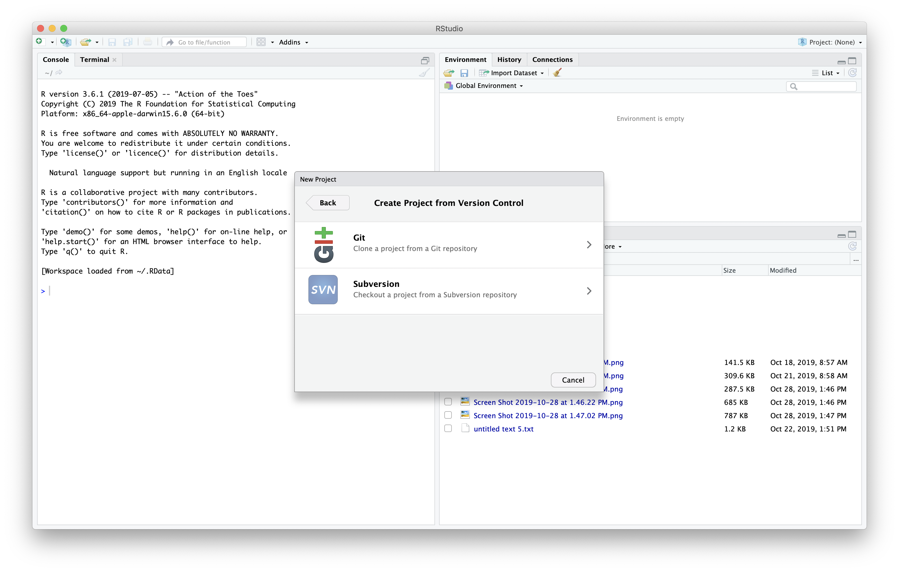
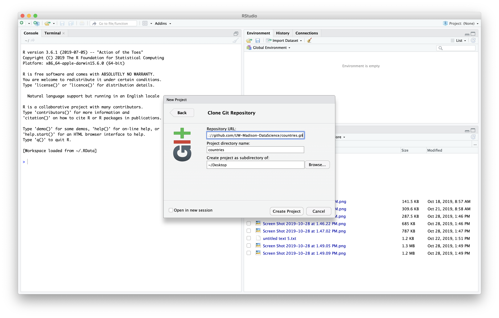

In the last lesson, we learned how to collaborate with someone by giving
them collaborator access to our repository.
In this lesson, we will learn how to suggest changes to a repository we don't own.

First we will navigate to the github repository we want to make a suggestion to.
In this case we will be adding a country to a group repository.

The first ting we need to do is "fork" the repository.
This means we will make a copy of this repo that we have access to modify.
We will click the "Fork" button in the upper right hand of Github.

Next we need to get a copy of this repository on our local machine (and in Rstudio).
We need to go back to the original repository, which is linked under the repo name.
We can clone the repository by copying the link under the "Clone or download button"

In R studio we will start a new project and choose the "Version Control" option.

Next we will tell it to expect a git repository.

Finally we will paste the URL, give the project a name (or leave blank to keep
the repo name), and tell it which folder to put the project in.
This will copy down the repository to our local computer.

Now we have the repository as a project in Rstudio.
This repo has been setup with a `.gitignore` and `README.md` file.

Now our repository a connection to the main version of this repository
but we also need it to have a connection to our fork of the repository.
First we click the "New Branch" button in the git tab.

We can then click the "Add Remote..." button to add our fork as a
remote.

The 'origin' remote is the one we cloned the repo from originally,
in this case the main repository.
We will need to switch back to our fork and copy the URL from the
"Clone and Download" button again.

Let's call this remote "my_fork", then paste the URL to our fork of
the repo, and press the "Add" button.

Before we make our changes we want to be sure we have the latest version of
the main repository.
It turns out, since we cloned it one of our colleagues
added a file to the repository.

We can use the git tab to pull down the latest changes.

We can see the new file in the file panel of Rstudio.

Before we make the changes, let's make a new branch to work in.
This way we can keep the master branch in line with the main repo.
We can make a new branch using the "New Branch" button in Rstudio.

We then will give our branch a new name.  I'll be add the country
France to the repository so I'll all my branch "AddFrance".
Be sure choose the remote "my_fork" since that is where we will
want to push the changes to when we are done.
Then we can click "Create".

Next we can use Rstudio as a text editor and look at the united states file.

We can then make a new country file and update the information.
You may need to look up the information for you country in the web browser.

We can then save and stage the file.

We can then commit the new file we added.

Then we can push those changes to our fork.

Now when we look at github we can see that there is a new branch.
Github prompts us to compare and make a pull request.

<!---  -->

Then we can fill in the information to submit the pull request.

Then the person who owns the repo can look at the pull request and make edits.

In our case our collaborator asked us if we could add the largest city to this file.

If we update the same branch we used in our pull request on our local machine
and push it to our fork, it will update the pull request.

We then need to stage and commit the changes.

<!---  -->

We can then push the changes to the repository.

Now we can see the new commit on our pull request.



