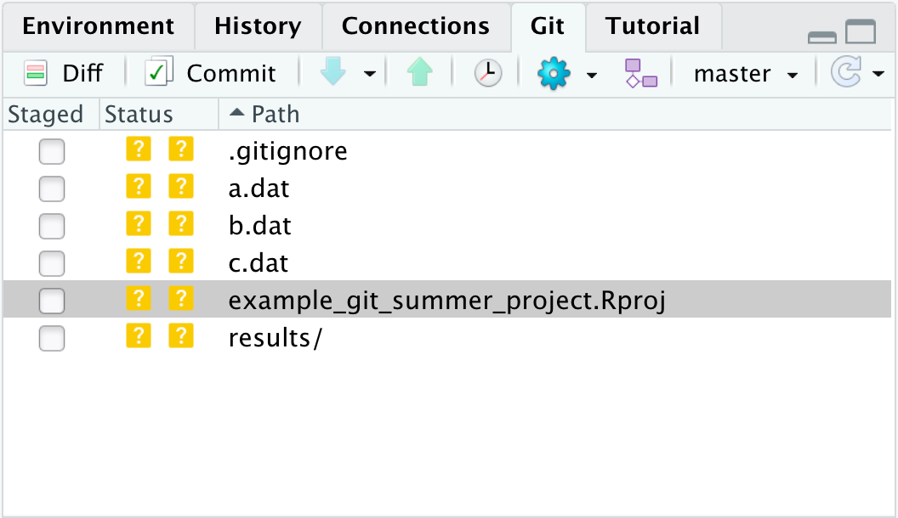
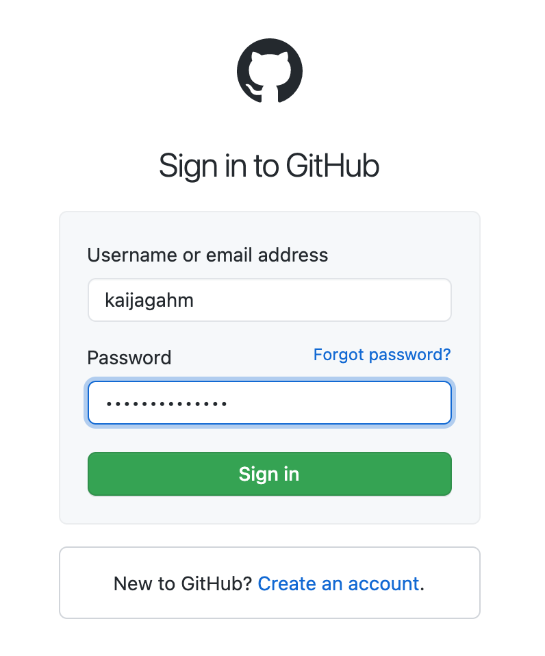

```{r, echo = FALSE, purl = FALSE, message = FALSE}
library(knitr)
library(tidyverse)
source("../bin/chunk-options.R")
knitr_fig_path("05-")
```

## Prerequisites and Setup

- Download [RStudio](https://www.rstudio.com/products/rstudio/download/) and [R](https://www.r-project.org/)
- [Create a GitHub account](https://github.com/signup?user_email=&source=form-home-signup)
- [Install Git](https://git-scm.com/downloads)
- This episode is aimed at people who have some knowledge of R and RStudio, but you don't have to be an expert.

## Motivation

## Setup: Summer Project

For this lesson you can imagine you are working on a summer project at a research station.
While there, you will collect data and analyze it using R.
You brought an old laptop from the lab to do your field work to avoid loosing or damaging your other computer.
You decide to use git to track your file changes so you can return to old versions of your scripts if needed.
Using git will also allow you to host your project folder in a repository on [GitHub][github], 
so if your laptop does get damaged you will still have your files and can work on the project on your other computer later.

### Create an R Project

A git repository is a folder that is under version control with git. 
Best practice is that the repository (also called repo) is the scale of a project.
So for our new summer project we will create a new folder and R project to work in.

Click on the new R project button in the upper left-hand side of RStudio. 

{: .image-with-shadow }

> ## Other ways to start a new project
>
> While clicking the New R Project Icon is the one step way to start a project, there are a couple other options.
> 
> 1. You can click the Project drop down menu and choose the "New Project..." option.
> 
> {: .image-with-shadow width="400px" }
> 
> 2. Alternatively, you can click the "File" menu and choose the "New Project..." option
> 
{: .callout}

Next the "New Project Wizard" will pop up in RStudio.
Since we are starting this project from scratch we will choose the "New Directory" option.

{: .image-with-shadow width="400px" }


Next the New Project Wizard asks us to chose a project type.
We will choose the "New Project" option again.

{: .image-with-shadow width="400px" }

Finally the New Project Wizard asks us what to name our new project folder, where to put it,
and some other options (including if we should make this a git repository).

We will call the folder "example_git_summer_project" and put it on the `Desktop`.
You may need to click "Browse..." to navigate to your Desktop folder.
The name is a bit long but will be useful for identifying it when you find it on your desktop or GitHub account later.
We also want to be sure the "Create a git repository" option is checked.
If you don't see this option, you may need to check that you have git installed.

{: .image-with-shadow width="400px" }

Finally we can click the "Create Project" button.

> ## Find the Project on Your Computer
> 
> Use Finder(mac) or File Explorer(windows) to find the project folder on your computer.
> *What files are in the project folder?*
> 
> > ## Solution
> > 
> > Your folder likely only shows one file in it, `example_git_summer_project.Rproj`.
> > If you close the project in RStudio (using the project dropdown menu on the upper right-hand side),
> > you can click on this file and it will reopen this project in RStudio.
> > 
> > You probably can't see it in your file viewr but when we set up the project,
> > we also created a hidden folder where git stores information called `.git/`.
> > We probably won't need to interact with this folder directly but it is where git will be storing the
> > history of your files in this project.
> > The folder is hidden by default in most file viewers so we can't accidently make changes to it.
> > See the following links if you'd like to try to see the hidden `.git/` folder
> > - [Windows](https://support.microsoft.com/en-us/windows/view-hidden-files-and-folders-in-windows-10-97fbc472-c603-9d90-91d0-1166d1d9f4b5#:~:text=Open%20File%20Explorer%20from%20the,folders%2C%20and%20drives%20and%20OK.)
> > - Mac - type <kbd>Shift</kbd> + <kbd>cmd</kbd> + <kbd>.</kbd> to toggle the hidden files showing in finder.
> >  
> >  Note: All files that start with `.` are hidden unless you turn on the option to see them.
> > 
> {: .solution}
{: .challenge}

## Working Locally With Git

You may now notice that in the Environment Pane (upper right-hand pane of default RStudio), there is now a "Git" tab.
This tab is where we can keep track of our files using git.
If we click on the tab, we will see it lists a couple of files.

{: .image-with-shadow width="500px" }

Both the `.gitignore` and the `example_git_summer_project.Rproj` file have two `?` in the status columns.
This means that git recognizes they have changes that are untracked by git.

We will come back to these files later when we talk about the `.gitignore` file.
For now we will ignore them ourselves.

Let's make a new R script for our summer project analysis.
So anyone who finds our script/repo later knows what the script is for and how to contact us, lets add our name, a script desciption, the date, and our email address to the top of the script.

{: .image-with-shadow width="400px" }

Next we will save the file to a new name.
This first script will be our data cleaning script, so let's call it `01-data_cleaning.R`.

{: .image-with-shadow width="400px" }

Now in the git pane we can see that it shows the new `01-data_cleaning.R` script with the two yellow `?` around it.
This means it recognizes the new file is in the repository and has yet to be tracked.

{: .image-with-shadow width="400px" }

To tell git we want to keep this version of the `01-data_cleaning.R` script, we first click the checkbox in the "Staged" column
of the git pane. This adds the file to the *stage* so git knows to include it in this point of our git history.
Once checked the two `?`'s turn into an `A`, for *added*.

{: .image-with-shadow width="200px" }

Next we will click the commit button in the git pane (highlighted with a red circle in the image above).
When we **commit** to the repository we add a version of the files that are staged to the git history.
Once we click the "Commit" button, a new window pops up to allow for more git interaction.
We can see on the left-hand side the same info that we've staged the data cleaning script.
On the right-hand side we have the opportunity to type a *commit message*.
This message is a note about what was changed in this version of the files committed.
We will type `Started script for data cleaning` as our commit message.

> ## What Makes a Good Commit Message?
> 
> The commit message is a great opportunity to leave yourself (or future collaborators)
> useful information about the history of the repository.
> While there are other tools to let you see what exactly changed, your commit message
> can address the motivation for the changes, the "why".  For large changes,
> it is also a great chance to summarize.
> Read more about some suggestions for helpful commit messages in [this blog post](https://chris.beams.io/posts/git-commit/).
{: .callout}

{: .image-with-shadow width="900px" }

Once we've added a commit message, we can click the commit button below the message window.
This action actually makes a point in our git history with this version of the file.
Once we click this button, we will see another small window pop up with info about the commit we just made.
The first line is the command that RStudio ran for us to commit the file using git.
The 2nd line gives a lot of information: the branch name (you can have multiple branches for experiments or collaboration,
that this is the first commit (root_commit), the first 7 digits of the *commit hash* - a unique identifer label for each commit,
and the commit message we wrote.
The 3rd line is a summary of the number of files and lines changed.
The last line is info about the file system permissions for the script we created, which we can mostly ignore here.

{: .image-with-shadow width="400px" }

Now that we've committed, we can close this pane by clicking the "Close" button.
Back in the other RStudio git window, we can see that the data cleaning script is no longer listed in the 
"changes" window on the upper-left, only the `.gitignore` and `.Rproj` files are listed since they have untracked changes.
Since all the changes for the data cleaning script are committed to our git repo, it is no longer listed.

Let's close this window and make more changes to our script.  Let's add a line to load the libraries we want to use.
While we are learning git in this lesson, we will write comments instead of actual R code.

{: .image-with-shadow width="400px" }

Once we save the new addition to the file, we can see that in the git pane the data cleaning script appears again.
This time the status shows as `M`, which means the file has been modified since the last time it was committed to the git history.

{: .image-with-shadow width="400px" }

We can follow the same process and add these changes to the stage and and commit this version of the file to our git history.
Notice when we check the "Staged" option the `M` moves from the right side of the status column to the left?
This is because those two sides idicate the status in the stage and outside the stage.
So the `M` on the left shows us that we had modified the file but it was unstaged.
When we clicked the "Staged" checkbox it moved the `M` to the left side to indicate the modified file was in the stage.
Reminder, the two `?` for the other files is because git has not yet tracked them at all, outside or within the stage.

<!--- extra image, just in case
{: .image-with-shadow }
-->
{: .image-with-shadow width="400px" }

In this commit, notice the bottom of the git window.  This section shows the *diff*, in this case it is showing us the differences
between the last time we committed and the new staged version of the file.
It highlights in green that we added two new lines.  It would show changed lines in yellow and removed lines in red.
In addition to the colors, we can use the line numbers to see which lines are changed, added, and removed.
The numbers on the left are the old lines and the ones on the right are the new lines.
Once we've previewed the *diff*, we can again click the commit button, write a commit message, and click commit.

{: .image-with-shadow width="900px" }

Then we get see the same summary window as before with info about our commit.

{: .image-with-shadow width="400px" }

> ## Try it yourself!
> 
> You will be creating/modifying files, adding, and committing them a lot when using git.
> Try adding and committing again, this time adding a comment about loading the data.
> 
{: .challenge}


> ## Exploring your Git History
> 
> Now that we've made 2-3 commits in our history, let's take a look at the history so far.
> Click on the button in the git pane that looks like a clock.
> Then you will be able to see the history of the repository.
> Click through and look at the diffs.
> How can you see the full *hash* for each commit?
> 
> > ## Solution
> > 
> > You can see the full has by clicking on a commit and looking under SHA.
> > SHA is another name for the commit hash, the unique id for each commit.
> > It stand for **S**ecure **H**ash **A**lgorithm.
> > Often times you can use the shorter version of a hash (as long as it is unique in a repo)
> > to refer to older versions of files.
> > 
> {: .solution}
{: .challenge}

One of the advantages to using git to version control your project is to get back to an older version of a file.
This is possible in a variety of ways from the terminal for other usages.
RStudio provides one way to get an old version of a file in a specfic instance, when we've not yet commited the new changes.

Lets add a new line to our script `# Broken Analysis`.  This line represents hours spend on a function that doesn't work and we want
to get back to the old version of our script. (In this case we could delete that function but we can pretend there is an old version
of the analysis we want to get back to.)

{: .image-with-shadow width="900px" }

To get back to our old version of the script, we can click the gear/cog icon in the git pane and then click the "Revert..." button.
It will then warn us because we have not committed this version so once we revert the only option to get it back would be to code it again.
In our case we are sure so we will click "Yes".  Now the script no longer has the broken analysis and is back 
to the version we last committed.  It also is no longer listed as having changes in the git pane.

> ## Other Ways to Get Old Versions
> 
> In other situations you might want to keep the broken version in your
> history by committing first and then getting back an old version.
> This is possible but would typically be done in the terminal or git bash
> and would be done with the `git checkout` or `git revert` commands.
> 
> Note: The `git revert` action acts differently than the revert we did in 
> RStudio.
> 
{: .callout}


### Ignoring Files

So far we've been ignoring the `.gitignore` file and the `.Rproj` file in the git pane.
Long term this would get tiresome and we would probably prefer to commit these files to the repository.
However there are files we wouldn't want to commit to the repo.
Common files you might want to ignore include:
- data files (since they shouldn't change much),
- larger files (as these will make your repo get large fast and some hosting services have size limits),
- files that aren't plain text (you might actually want to commit some of these but they won't show nice diffs and will take
up more space because git will keep a full copy of the file each time it is commited)

Lets create some fake data files and results to ignore in our folder.

- In the Files pane, click "New Folder", create a new folder called `results`
- Click the New File button and choose "Text file"
- Save the file as `a.dat`
- Repeat this process until you have the following files in the project folder:
    * `a.dat`
    * `b.dat`
    * `c.dat`
- Repeat this process and create the following files in the `results` folder:
    * `a.out`
    * `b.out`

Now our git pane will show the new folders and files.

{: .image-with-shadow width="400px" }

Note that we can only see the one listing for the `results` folder.
Git will try to track any file in our repository, including the directories within subdirectories (though not actually the folder itself).
If we try to add the `results` directory to the stage, it will then let us choose if we want to add all the files or some of the files within that folder.
However, we don't want to add these files the repo, the ones that end in `.dat` are data files that won't change and the `.out` files are
the results from an analysis and are rather large (in our imagination).

Instead we can tell git it shouldn't try to track these files by adding their names to the `.gitignore` file.
Let's open it and take a look.  Double click on the `.gitignore` file in the Files pane and it will 
open in the source pane.  We can see it actually already has some files included!
These files all start with `.` so we don't typically see them in our file folders.
However, they are important files for R to keep track of the history and other data it uses.
RStudio added them to the `.gitignore` file when we created this project because these are files that are commonly
not included in git repositories.

{: .image-with-shadow width="900px" }

Let's add a couple lines to the `.gitignore` file so git will ignore our data and results files.
We will add a line using a line that says `*.dat` to ignore any file that ends in `.dat`.
We will also add a line for the whole `results/` folder.

Once you've saved, you might notice that nothing changed in the git pane! 
This is because we need to refresth by clicking the arrow circle button on the right-hand side of the git pane.

{: .image-with-shadow }

Now we can see that the data and results files no longer show up in the git pane.

{: .image-with-shadow width="400px" }

> ## Adding New Result/Output files
> 
> What happens if you add a new `d.dat` file or `results/c.out` file?  Try it out!
> 
> > ## Solution
> > 
> > Those files still aren't shown in the git pane since they match paterns in the .gitignore file.
> > If later you want to track a single file that matches that pattern, you can add a line to the
> > `.gitignore` file that has the file name with a `!` in front of it to unignore that individual
> > file but ignore the rest of those that match the pattern.
> > 
> {: .solution}
{: .challenge}

> ## Should We Ignore the `.Rproj` and `.gitignore` file?
> 
> We could add `.gitignore` and `example_git_summer_proj.Rproj` to the gitignore and then we wouldn't see them
> listed in the git pane all the time.  However these are files that it is good to commit
> to your repo.  Knowing which files you were ignoring on a different machine can be useful if you sync
> this repo elsewhere later.  You will want to have the Rproj setup on the other computer as well.
> 
> Add and commit these two files at the same time (with the same commit) to your repo.
> 
{: .challenge}

> ## Look at History for a Single File
> 
> Take a look at your git history, try to figure out how to see only the history for the `01-data_cleaning.R` file.
> 
> > ## Solution
> > 
> > - Click the History Button in the git pane (looks like a clock)
> > - Click the "(all commits)" Drop down menu at the top of the commit window
> > - Choose "Filter by File..."
> > - Choose `01-data_cleaning.R`.
> > - Now you will not see the commits that don't include the `01-data_cleaning.R` file.
> > 
> {: .solution}
{: .challenge}

## Connecting to GitHub

### Creating and Using an SSH Key

So far, we've been using Git to version control our files locally. But now we're going to connect our local repository to a 'remote'. 
A 'remote' is any git repository that is hosted on the internet, not just on a local computer. 
In our case, the remote is going to be hosted on GitHub.

Pretty soon, we're going to create a repo on GitHub and establish a connection between that repo and the local Git repo 
that we've been working with up until this point. But first, we need to create and use some login credentials that will show GitHub 
that we are who we say we are. This is required so that GitHub repos can only be modified by the people who created or are allowed to access them. 

We're going to use a method of authentication called SSH, which stands for 'secure shell' protocol. Basically, SSH is 
a way for two computers (our local computer and the GitHub server) to communicate, with all information transfer encrypted 
for security. It operates through public and private 'keys', which are strings of numbers and letters.

To connect Git to GitHub, we have to generate a new SSH key. To do that, we'll follow the instructions in [this article](https://docs.github.com/en/github/authenticating-to-github/connecting-to-github-with-ssh/generating-a-new-ssh-key-and-adding-it-to-the-ssh-agent) 
to check for an existing SSH key, generate a new key, and save the key (protected by a passphrase).

If you're on a Windows computer, use Git Bash to run these commands. On a Mac, use the Terminal.

Now that we've created a public/private key pair, we're going to copy the public key and add it to our GitHub account. 
To do that, we'll follow the instructions in [this article](https://docs.github.com/en/github/authenticating-to-github/connecting-to-github-with-ssh/adding-a-new-ssh-key-to-your-github-account).

**Note:** This process may seem really complicated and intimidating. Luckily, you only have to do it once, or at least only once per computer
you want to set up Git on. You **don't** have to set up a new SSH key every time you want to make edits to your project!

### Creating a GitHub repository

Now, we'll go to GitHub and sign in.

{: .image-with-shadow }

Signing in takes us to a dashboard page, showing all of our activity and listing some of our repositories. 
On the lefthand side of the page, there's a toolbar with a heading, under your profile icon, that says **Repositories**. 
We'll click on the green button labeled 'New'.

{: .image-with-shadow }

The first thing that we'll be asked to do is to name our repo. To make things as clear and consistent as possible, 
we're going to go ahead and name it the same thing as the local repo that we already created: 'example_git_summer_project'. 
If you want, you can briefly describe the repository. Maybe add a note about the context in which you created this repo?

Next, you have the option to choose whether the repository is public or private. If you make it public, anyone on the 
internet can go to your GitHub account and see this repository. You'll still be able to manage edit access (so, random 
people can't just come in and change your code without your approval). If you keep the repository private, people won't 
be able to see it unless you specifically invite them as collaborators.

{: .image-with-shadow }

> ## Public and Private Repositories
> 
> Before January 2019, free GitHub accounts didn't come with private repositories--
> you had to have a paid account for that. As of 2019, free accounts include unlimited
> private repositories, each with up to 3 collaborators, according to [this announcement]().
> This is an exciting change that's great for working on private projects!
>
> You should choose whatever repository visibility works for you. If your project includes
> data or code that you don't want to share, a private repo might be a good option.
> But if you keep it public, others can more easily learn from and contribute to
> your work!
> 
{: .callout}

Finally, there are a few more checkboxes, asking you whether you want to add a README, a .gitignore file, or a license.
These checkboxes should be un-checked by default. We're going to leave them that way.
Adding a README is a good idea in general and you would probably want to add one eventually if this was a real project,
but adding one at this stage can complicate the process of joining the local and remote repos.
We already have a .gitignore file in our local repo--that's the document that we added lines to so that Git wouldn't 
track our data and output files. If we create a new one in this remote repo, once again, the process of
joining the local and remote repos will get complicated.
A license can be a good idea depending on your project--but that's beyond the scope of this lesson.

{: .image-with-shadow }

Click the green 'Create Repository' button, and your repository has been created!

The next page you see will look something like this. In the box labeled **Quick setup — if you’ve done this kind of thing before**, 
you'll notice a toggle where you can choose either HTTPS or SSH, with a box directly to the right that contains a URL. That URL is 
the web address of the remote repo that you just created. We're going to use that address to tell our local computer how to connect
to the remote. The default is HTTPS, but because we set up authentication with SSH keys, we're going to choose the SSH option. 
When you pick that option, you'll see the URL in the box change slightly.

{: .image-with-shadow }

Copy that URL to your clipboard, either by clicking the small clipboard icon at the right, or by highlighting it and copying
it manually.

{: .image-with-shadow }

### Connecting the Local and Remote Repositories

Now, we're going to connect our local Git repository to this newly-created 'remote' repository. This means that we'll
be able to take changes we make locally and 'push' them to the remote repo, where they will be visible and accessible
online. As you might imagine, this is very useful for collaborating on a project with other people. But as we'll see
in a little while, it's also very useful for collaborating with *yourself*. If you move to a new computer, or if you
want to work on the same project from two computers or locations, it will be easy to access your changes from anywhere.

Go back to RStudio, and look at the Git pane. Along the top edge, you should see an icon that looks like two purple
boxes and a white square. Click on that icon.

{: .image-with-shadow }

A 'New Branch' dialog window will pop up, including a small button that says 'Add remote'. Click on that button.

{: .image-with-shadow }

Now you will see a new 'Add remote' dialog that looks like this.

{: .image-with-shadow }

In the 'Remote URL' field, paste the SSH URL that you just finished copying from your newly-created GitHub repo.
In the 'Remote Name' field, type 'origin'.
Now click 'Add'.

Now you should be back in the 'New Branch' window (if you're not, click on the 'two purple boxes and a white square' icon again).
We want to make sure that the main branch of the local repo corresponds to the main branch of the remote repo on GitHub. So let's
enter 'main' as the Branch Name, and make sure that 'Sync branch with remote' is checked. Click 'create'. This may seem a little
weird, since the 'main' branch already exists in the local repo by default, but do it anyway. 

{: .image-with-shadow }

Because we're adding a branch that already exists, we'll see one more dialog, asking if we want to overwrite the existing
branch (the 'main' branch in the local repo). Click 'Overwrite' here (**not** the default option, 'Checkout').

{: .image-with-shadow }

What we're doing here is making sure that the local and remote branches are all synced up, so that it will go smoothly when we 
push and pull our changes later on.

### Pushing changes

Okay, now we have our local and remote repos connected. Now, we want to *push* the changes we made locally to the remote,
so that they'll show up on GitHub.

In the top of the Git pane in RStudio, you'll see two arrows: a blue one pointing down and a green one pointing up.

{: .image-with-shadow }

The blue arrow is for 'pulling' changes from the remote to your local repo. The green arrow is for 'pushing'
changes from your local repo to the remote.

> ## Pushing vs. Pulling
> 
> If the up and down arrows don't intuitively match to the concepts of 'pushing' and 'pulling' for you,
> it might help to think of your local computer sitting on a table, communicating with the remote repo
> on the internet, or 'in the cloud'. If we continue that metaphor, 'the cloud' is high up somewhere in the 
> sky, so we *pull downward* from the cloud to our computer and *push upward* from our computer to the cloud.
> 
{: .callout}

Let's go ahead and click the green 'Push' arrow to push our changes to GitHub. 

Now, open a browser window and let's go view our GitHub repo online. If you named your remote repo 'example_git_summer_project', then
the url will be **https://github.com/yourusername/example_git_summer_project**.

Opening up the main page of the repo should show us a familiar collection of files. We can see our .gitignore, our 
.Rproj file, and the '01-data_cleaning.r' script that we created and edited. We can also recognize the commit messages
that we entered. The most recent commit message for each file displays immediately to the right of the file name.

{: .image-with-shadow }

### Working on a Different Computer

It's useful to store changes on GitHub for many reasons, but one use case is working on the same project from a different computer.
When you were doing field work over the summer, you used a laptop, but once the summer's over, you might want to work on the same
analysis from your desktop computer at home. Since all your analyses are saved on GitHub now, you'll be able to create a repository on the 
home computer and connect it to the remote to access those files.

So, let's pretend you're now working on your home computer.

The first step to *cloning* (aka copying) the remote repo from GitHub to your home computer is to create a new R project.
We're going to do the sequence of events a little differently here. 

First, go to the main page of your 'example_git_summer_project' repository on GitHub. Click the green 'Code' download
button. A small window will open up with a field that shows the SSH URL (similar to what we saw before). Go ahead and copy that
URL to your clipboard, either using the small clipboard icon to its right, or by copying manually.

{: .image-with-shadow }

Now, go back to RStudio. Using any of the several methods that we saw before, choose New Project. But then, in the New 
Project Wizard, instead of choosing 'New Directory', pick the 'Version Control' option.

{: .image-with-shadow }

The next window will have you choose which version control software you're using. Choose 'Git'. (Subversion is another
version control system).

{: .image-with-shadow }

Okay, now we can paste in the URL we copied from GitHub, into the 'Repository URL' field. The 'Project directory name' field will
automatically populate. 

Now, here's the weird part. If we were **really** working on a new computer, we would be all set here. We could just click 
'Create Project' and our new project would be created. But since right now we're working on the same computer as before
and just pretending that this is a new, home computer, doing that would create two local repos with the exact same name, which
would cause problems. So, let's change the 'Project directory name' to 'summer_project_home_computer' or something similar.

{: .image-with-shadow }

Okay, **now** we can choose 'Create Project'.
RStudio will clone all of the files from the remote repo on GitHub into the newly-created 'summer_project_home_computer' 
local repo, and will automatically open up a new, fresh, RStudio session. As before, you should see a Git tab in the pane
next to your History and Environment.

The Files pane should also look familiar now, with our .Rproj, .gitignore, and 01-data_cleaning.R script. But there's a
problem. If you tried to run your analyses right now, on this new computer, you wouldn't be able to. Why?

> ## Setting Up a Project on a New Computer
> 
> What other steps might you need to take to get this project ready to run, so you could seamlessly replicate the
> analyses you ran on your field computer?
> 
> > ## Solution
> > 
> > Because we added our data and output files to the .gitignore, Git doesn't track them. That means they don't
> > show up on the remote GitHub repo, which in turn means that when we clone/download the data and code from the
> > remote to our home computer, the data and output files don't come along.
> > So, if you wanted to re-run your analyses and have everything work, you would have to manually transfer your data
> > files from the other computer to this one. Then, you could re-create those output files by running the R scripts
> > that read in the raw data.
> > 
> > So, this is one of the weaknesses of relying on version control: you still need a system for managing your data.
> > Let's talk about possible ways to store and manage data, depending on whether it needs to be private or not.
> > What are some strategies or workflows you've used in the past or might use in the future for storing data
> > in tandem with version-controlled workflows?
> > 
> {: .solution}
{: .challenge}

Okay, so now we have our project set up on the home computer. Let's go ahead and do a little work! Make a change
to the 01-data_cleaning.R script, and commit it, writing a commit message.

{What questions do you have about making and committing a change? Do you remember how we did it before?}

Now, let's pretend you switched computers back to the laptop you used in the field. So we want to switch back to
our 'example_git_summer_project' local repo (again, pretending that we are actually *switching computers*). 

There are a couple ways to do this.
1) You can navigate to the 'example_git_summer_project' directory wherever you stored it on your computer, using
Finder/File Explorer.
2) At the top of your 'summer_project_home_computer' session of RStudio, there's an R Project icon that shows the name
of the current project. Clicking that brings up a dropdown menu that we've seen before, with the option to create
a new project *or* select one of the recent projects you've been working on. 

{: .image-with-shadow }

Either way, open up that project. Now open the '01-data_cleaning.R' script. The change you just made on your home
computer isn't there. Why? How can we fix this?

> ## Syncing Changes Between Local Repos
> 
> Why doesn't the change you made on your home computer show up in the repository on your laptop? How can we
> get it to show up there?
> 
> > ## Solution
> > 
> > We made a change to the local copy of the script saved on the home computer, but we didn't *Push* that change,
> > so it won't show up on GitHub. 
> > If we go ahead and click 'Push' in the home computer repo, now the change will show up on GitHub (you can 
> > navigate to the repository page and refresh it to be sure).
> > But if you navigate back to the 'summer_project_home_computer' project, that change *still* doesn't show up!
> > That's because we also need to *Pull* the change down from GitHub to this other local repository. 
> > So, syncing the repositories is a two step process: After making local changes, *Push* them to GitHub so they
> > can be accessed, and then in the new local repo, *Pull* down from GitHub to make sure your copy of the repo is
> > up to date before starting to work.
> > It's always a good idea to *Pull* changes before you begin to work in a remote repo, especially if you're
> > collaborating with other people who may have made changes while you weren't working, but even if it's just
> > you and you have multiple clones of the same repo in different locations.
> > 
> {: .solution}
{: .challenge}

This process of pushing and pulling to keep things up to date is very important. In the next section, we're going to explore
the conflicts that can come up if you forget to push/pull, and how to deal with them.

## Dealing with merge conflicts

So, what if we forget to push and pull? Let's act out this scenario so we can see what happens.

First, open up the 'summer_project_home_computer' project (i.e. open the project 'on your home computer').
Make a change to the 01-data_cleaning.R script, on line 3 (you can just add a comment). Commit your change,
and push it.

Great. Now, let's imagine that you're working on the project temporarily from your field laptop again, and you
want to do some coding. Open up 'example_github_summer_project' (i.e. open the project 'on the field laptop').
**Don't** pull.

You want to add a data cleaning step to line 3. You're a little confused, because you're pretty sure
you already added that step the other day, but you don't see it here. "Huh", you think. "That's funny.
Oh well, I guess I must have forgotten to save my work!" It's no big deal, since you remember what you wrote.
Go ahead and make your change (a comment, for our purposes) on line 3 of the script.

Commit your changes and push. Uh oh! The push gets rejected. You get a big scary error message.

{: .image-with-shadow }

But if we read the error message, it's actually pretty informative. It says "Updates were rejected
because the remote contains work that you do not have locally. This is usually caused by another
repository pushing t the same ref. You may want to first integrate the remote changes (e.g., 'git
pull ...') before pushing again."

So, this tells us what our mistake was: we should have pulled changes from the remote before 
pushing new changes.

We have created a *merge conflict*. Merge conflicts happen when there are two changes made
to the same line of the same file, and Git doesn't know which one to keep. If we look back at the 
staged/status window, we see a new icon, a U. The diff window shows that both the old change and the new change to this file are present, and we also see some lines of = signs and < > signs.

{: .image-with-shadow }

So, how do we fix this?

Open up the file and decide which of the changes you want to keep. Manually delete the <<<< and 
===== and >>>> lines, as well as deleting the change that you want to get rid of.

Now, stage and commit this fix. Your commit message could be something like 'resolving merge conflict'.

{: .image-with-shadow }

And now push your changes. Ta-da! The repository is all fixed.

> ## Committing and Pushing
> 
> How often, or after what activities, might you want to commit and/or push? What are the tradeoffs?
> 
{: .discussion}
