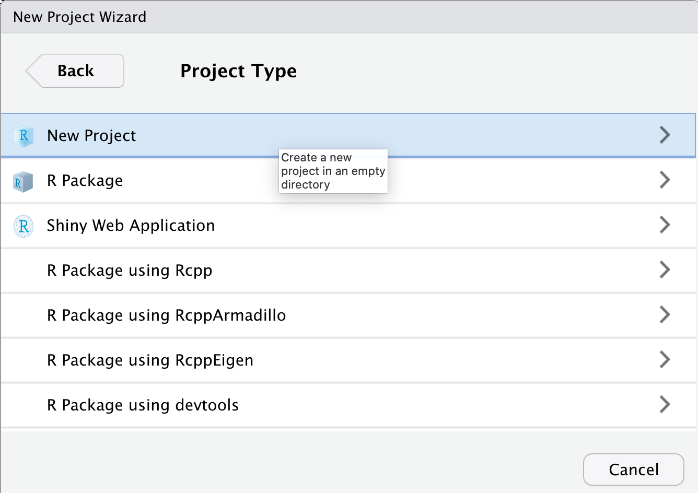

```{r, echo = FALSE, purl = FALSE, message = FALSE}
library(knitr)
library(tidyverse)
source("../bin/chunk-options.R")
knitr_fig_path("05-")
```

## Prerequisites and Setup

- Download [RStudio](https://www.rstudio.com/products/rstudio/download/) and [R](https://www.r-project.org/)
- [Create a GitHub account](https://github.com/signup?user_email=&source=form-home-signup)
- [Install Git](https://git-scm.com/downloads)
- This episode is aimed at people who have some knowledge of R and RStudio, but you don't have to be an expert.

## Motivation

## Setup: Summer Project

For this lesson you can imagine you are working on a summer project at a research station.
While there, you will collect data and analyze it using R.
You brought an old laptop from the lab to do your field work to avoid loosing or damaging your other computer.
You decide to use git to track your file changes so you can return to old versions of your scripts if needed.
Using git will also allow you to host your project folder in a repository on [GitHub][github], 
so if your laptop does get damaged you will still have your files and can work on the project on your other computer later.

### Create an R Project

A git repository is a folder that is under version control with git. 
Best practice is that the repository (also called repo) is the scale of a project.
So for our new summer project we will create a new folder and R project to work in.

Click on the new R project button in the upper left-hand side of Rstudio. 

{: .image-with-shadow }

> ## Other ways to start a new project
>
> While clicking the New R Project Icon is the one step way to start a project, there are a couple other options.
> 
> 1. You can click the Project drop down menu and choose the "New Project..." option.
> 
> {: .image-with-shadow }
> 
> 2. Alternatively, you can click the "File" menu and choose the "New Project..." option
> 
{: .callout}

Next the "New Project Wizard" will pop up in Rstudio.
Since we are starting this project from scratch we will choose the "New Directory" option.

{: .image-with-shadow }


Next the New Project Wizard asks us to chose a project type.
We will choose the "New Project" option again.

{: .image-with-shadow }

Finally the New Project Wizard asks us what to name our new project folder, where to put it,
and some other options (including if we should make this a git repository).

We will call the folder "example_git_summer_project" and put it on the `Desktop`.
You may need to click "Browse..." to navigate to your Desktop folder.
The name is a bit long but will be useful for identifying it when you find it on your desktop or GitHub account later.
We also want to be sure the "Create a git repository" option is checked.
If you don't see this option, you may need to check that you have git installed.

{: .image-with-shadow }

Finally we can click the "Create Project" button.

> ## Find the Project on Your Computer
> 
> Use Finder(mac) or File Explorer(windows) to find the project folder on your computer.
> *What files are in the project folder?*
> 
> > ## Solution
> > 
> > Your folder likely only shows one file in it, `example_git_summer_project.Rproj`.
> > If you close the project in Rstudio (using the project dropdown menu on the upper right-hand side),
> > you can click on this file and it will reopen this project in Rstudio.
> > 
> > You probably can't see it in your file viewr but when we set up the project,
> > we also created a hidden folder where git stores information called `.git/`.
> > We probably won't need to interact with this folder directly but it is where git will be storing the
> > history of your files in this project.
> > The folder is hidden by default in most file viewers so we can't accidently make changes to it.
> > See the following links if you'd like to try to see the hidden `.git/` folder
> > - [Windows](https://support.microsoft.com/en-us/windows/view-hidden-files-and-folders-in-windows-10-97fbc472-c603-9d90-91d0-1166d1d9f4b5#:~:text=Open%20File%20Explorer%20from%20the,folders%2C%20and%20drives%20and%20OK.)
> > - Mac - type <kbd>Shift</kbd> + <kbd>cmd</kbd> + <kbd>.</kbd> to toggle the hidden files showing in finder.
> >  
> >  Note: All files that start with `.` are hidden unless you turn on the option to see them.
> > 
> {: .solution}
{: .challenge}

You may now notice that in the Environment Pane (upper right-hand pane of default Rstudio), there is now a "Git" tab.
This tab is where we can keep track of our files using git.
If we click on the tab, we will see it lists a couple of files.

{: .image-with-shadow }

First we see the `.gitignore` file.
This is a file that was created when we set up the project/repo.
It contains a list of files that we don't want git to try to track.
When you set up a R project with git, the new project wizard added some R files to the `.gitignore` file 
because these are commonly files that we don't want to track with git.
For example it ignores the `.Rhistory` file which keeps track of the history of commands run in the console, 
which you can see by clicking on the "History" tab in the  environment pane.
That isn't a file that we need to track in our version history but is useful for Rstudio to keep while we are working with it.

The second file listed is our `example_git_summer_project.Rproj` file.

Both of these are files (`.gitignore` and `example_git_summer_project.Rproj`) we would like to have git track the history of.
In the git pane, you can see it currently shows two `?` in the "Status" column.
This means that git has yet to track any versions of these files in it's history.

The next thing we will do is add a version of these files to the git history.
This is the most common action you will do with files.
Whenever you add a new file you want to keep track of or a new version you want to record in the git history (so you could go back to it later),
you will follow this process.

First you will tell git which files you want to add to this point in history by clicking the checkboxes under the "Staged" column.
This adds the files to the stage, which tells git that these are a version of the files we'd like to include or *commit* to our git history.

{: .image-with-shadow }

Notice that the "Status" column changed for both of the files as we clicked on it to showing an `A` instead of two `?`.
This indicates that the files have been *added* to the stage.

The next step we want to do is actually *commit* these changes to our history of changes in git.

To do so we will click the "Commit" button.

{: .image-with-shadow }

This will pop up a new window for making the commit.
This window has a lot of information in it and options you can do with it.
For now we will ignore most of the information and focus on the "Commit message" window.

Check that both of the files we want to include are checked and have the Status `A` still.
Then type `first commit of gitignore and rproj` in the  "Commit messsage" box.
This message goes into your history and can be useful for figure out what version of the files you committed in the past.
They are typically kept short but you can create longer messages if needed, this is typically done as a short message on the first line
and then a longer message on the third line.

{: .image-with-shadow }

Finally we will press the "Commit" button.  This actually adds the versions of the files to your repository.
This then pops up a message that summarizes the commit: which files were included, how they changed, the commit message, 
and the uninque identifier (called "commit hash").

{: .image-with-shadow }

We can then click the "Close" button on this commit.
Now the commit window is empty because all the changes to the files in repository have been commited or saved to the repository.

{: .image-with-shadow }

We can also exit out of the commit window and see that our git pane is also empty.

{: .image-with-shadow }


- create local folder
- create analysis script, just comments, no code.
- [generating key and adding it to the ssh agent](https://docs.github.com/en/github/authenticating-to-github/connecting-to-github-with-ssh/generating-a-new-ssh-key-and-adding-it-to-the-ssh-agent) [adding new ssh key to gh account](https://docs.github.com/en/github/authenticating-to-github/connecting-to-github-with-ssh/adding-a-new-ssh-key-to-your-github-account)

## Working locally with Git
- stage and commit
- changes, stage, commit again
- git log
- checkout of some sort (is there a way to do this interactively?)
- gitignore (use the interactive gui)

## Connecting to GitHub
- Kaija will do some digging to look at setting up GitHub secondarily--if it's complicated, we'll just do it first. 
- push/pull

## Basic branching and merging
- making a new branch
- local vs. remote branch

## Dealing with merge conflicts
- make same change on same line to two different branches


[github]: https://github.com/
