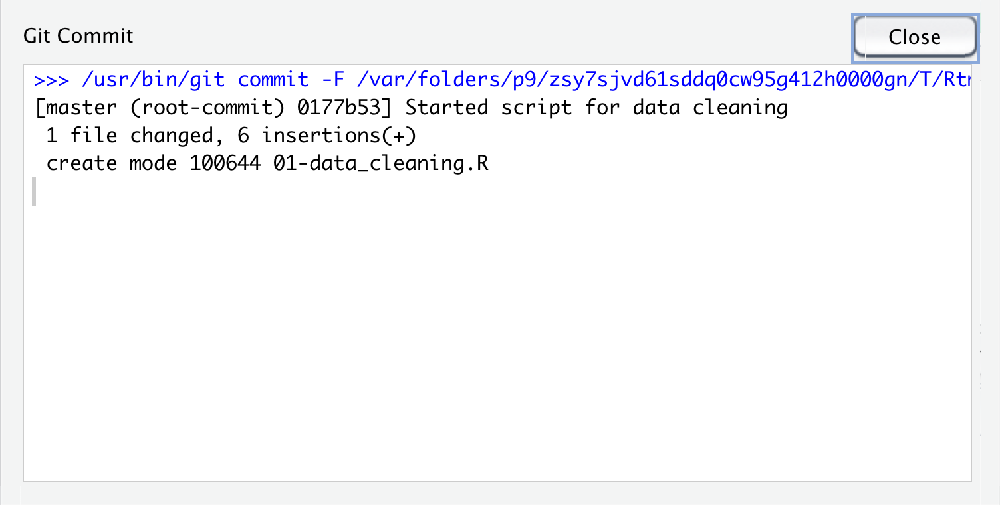

```{r, echo = FALSE, purl = FALSE, message = FALSE}
library(knitr)
library(tidyverse)
source("../bin/chunk-options.R")
knitr_fig_path("05-")
```

## Prerequisites and Setup

- Download [RStudio](https://www.rstudio.com/products/rstudio/download/) and [R](https://www.r-project.org/)
- [Create a GitHub account](https://github.com/signup?user_email=&source=form-home-signup)
- [Install Git](https://git-scm.com/downloads)
- This episode is aimed at people who have some knowledge of R and RStudio, but you don't have to be an expert.

## Motivation

## Setup: Summer Project

For this lesson you can imagine you are working on a summer project at a research station.
While there, you will collect data and analyze it using R.
You brought an old laptop from the lab to do your field work to avoid loosing or damaging your other computer.
You decide to use git to track your file changes so you can return to old versions of your scripts if needed.
Using git will also allow you to host your project folder in a repository on [GitHub][github], 
so if your laptop does get damaged you will still have your files and can work on the project on your other computer later.

### Create an R Project

A git repository is a folder that is under version control with git. 
Best practice is that the repository (also called repo) is the scale of a project.
So for our new summer project we will create a new folder and R project to work in.

Click on the new R project button in the upper left-hand side of Rstudio. 

{: .image-with-shadow }

> ## Other ways to start a new project
>
> While clicking the New R Project Icon is the one step way to start a project, there are a couple other options.
> 
> 1. You can click the Project drop down menu and choose the "New Project..." option.
> 
> {: .image-with-shadow }
> 
> 2. Alternatively, you can click the "File" menu and choose the "New Project..." option
> 
{: .callout}

Next the "New Project Wizard" will pop up in Rstudio.
Since we are starting this project from scratch we will choose the "New Directory" option.

{: .image-with-shadow }


Next the New Project Wizard asks us to chose a project type.
We will choose the "New Project" option again.

{: .image-with-shadow }

Finally the New Project Wizard asks us what to name our new project folder, where to put it,
and some other options (including if we should make this a git repository).

We will call the folder "example_git_summer_project" and put it on the `Desktop`.
You may need to click "Browse..." to navigate to your Desktop folder.
The name is a bit long but will be useful for identifying it when you find it on your desktop or GitHub account later.
We also want to be sure the "Create a git repository" option is checked.
If you don't see this option, you may need to check that you have git installed.

{: .image-with-shadow }

Finally we can click the "Create Project" button.

> ## Find the Project on Your Computer
> 
> Use Finder(mac) or File Explorer(windows) to find the project folder on your computer.
> *What files are in the project folder?*
> 
> > ## Solution
> > 
> > Your folder likely only shows one file in it, `example_git_summer_project.Rproj`.
> > If you close the project in Rstudio (using the project dropdown menu on the upper right-hand side),
> > you can click on this file and it will reopen this project in Rstudio.
> > 
> > You probably can't see it in your file viewr but when we set up the project,
> > we also created a hidden folder where git stores information called `.git/`.
> > We probably won't need to interact with this folder directly but it is where git will be storing the
> > history of your files in this project.
> > The folder is hidden by default in most file viewers so we can't accidently make changes to it.
> > See the following links if you'd like to try to see the hidden `.git/` folder
> > - [Windows](https://support.microsoft.com/en-us/windows/view-hidden-files-and-folders-in-windows-10-97fbc472-c603-9d90-91d0-1166d1d9f4b5#:~:text=Open%20File%20Explorer%20from%20the,folders%2C%20and%20drives%20and%20OK.)
> > - Mac - type <kbd>Shift</kbd> + <kbd>cmd</kbd> + <kbd>.</kbd> to toggle the hidden files showing in finder.
> >  
> >  Note: All files that start with `.` are hidden unless you turn on the option to see them.
> > 
> {: .solution}
{: .challenge}

## Working Locally With Git

You may now notice that in the Environment Pane (upper right-hand pane of default Rstudio), there is now a "Git" tab.
This tab is where we can keep track of our files using git.
If we click on the tab, we will see it lists a couple of files.

{: .image-with-shadow }

Both the `.gitignore` and the `example_git_summer_project.Rproj` file have two `?` in the status columns.
This means that git recognizes they have changes that are untracked by git.

We will come back to these files later when we talk about the `.gitignore` file.
For now we will ignore them ourselves.

Let's make a new Rscript for our summer project analysis.
So anyone who finds our script/repo later knows what the script is for and how to contact us, lets add our name, a script desciption, the date, and our email address to the top of the script.

{: .image-with-shadow }

Next we will save the file to a new name.
This first script will be our data cleaning script, so let's call it `01-data_cleaning.R`.

{: .image-with-shadow }

Now in the git pane we can see that it shows the new `01-data_cleaning.R` script with the two yellow `?` around it.
This means it recognizes the new file is in the repository and has yet to be tracked.

{: .image-with-shadow }

To tell git we want to keep this version of the `01-data_cleaning.R` script, we first click the checkbox in the "Staged" column
of the git pane. This adds the file to the *stage* so git knows to include it in this point of our git history.
Once checked the two `?`'s turn into an `A`, for *added*.

{: .image-with-shadow }

Next we will click the commit button in the git pane (highlighted with a red circle in the image above).
When we **commit** to the repository we add a version of the files that are staged to the git history.
Once we click the "Commit" button, a new window pops up to allow for more git interaction.
We can see on the left-hand side the same info that we've staged the data cleaning script.
On the right-hand side we have the opportunity to type a *commit message*.
This message is a note about what was changed in this version of the files committed.
We will type `Started script for data cleaning` as our commit message.

> ## What Makes a Good Commit Message?
> 
> The commit message is a great opportunity to leave yourself (or future collaborators)
> useful information about the history of the repository.
> While there are other tools to let you see what exactly changed, your commit message
> can address the motivation for the changes, the "why".  For large changes,
> it is also a great chance to summarize.
> Read more about some suggestions for helpful commit messages in [this blog post](https://chris.beams.io/posts/git-commit/).
{: .callout}

{: .image-with-shadow }

Once we've added a commit message, we can click the commit button below the message window.
This action actually makes a point in our git history with this version of the file.
Once we clicke this button we will see another small window pop up with info about the commit we just made.
The first line is the command that Rstudio ran for us to commit the file using git.
The 2nd line gives a lot of information: the branch name (you can have multiple branches for experiments or collaboration,
that this is the first commit (root_commit), the first 7 digits of the *commit hash* - a unique identifer label for each commit,
and the commit message we wrote.
The 3rd line is a summary of the number of files and lines changed.
The last line is info about the file system permissions for the script we created, which we can mostly ignore here.

{: .image-with-shadow }

Now that we've committed, we can close this pane by clicking the "Close" button.
Back in the other RStudio git window, we can see that the data cleaning script is no longer listed in the 
"changes" window on the upper-left, only the `.gitignore` and `.Rproj` files are listed since they have untracked changes.
Since all the changes for the data cleaning script are committed to our git repo, it is no longer listed.

Let's close this window and make more changes to our script.  Let's add a line to load the libraries we want to use.
While we are learning git in this lesson, we will write comments instead of actual R code.

{: .image-with-shadow }

Once we save the new addition to the file, we can see that in the git pane the data cleaning script appears again.
This time the status shows as `M`, which means the file has been modified since the last time it was committed to the git history.

{: .image-with-shadow }

We can follow the same process and add these changes to the stage and and commit this version of the file to our git history.
Notice when we check the "Staged" option the `M` moves from the right side of the status column to the left?
This is because those two sides idicate the status in the stage and outside the stage.
So the `M` on the left shows us that we had modified the file but it was unstaged.
When we clicked the "Staged" checkbox it moved the `M` to the left side to indicate the modified file was in the stage.
Reminder, the two `?` for the other files is because git has not yet tracked them at all, outside or within the stage.

<!--- extra image, just in case
{: .image-with-shadow }
-->
{: .image-with-shadow }

In this commit, notice the bottom of the git window.  This section shows the *diff*, in this case it is showing us the differences
between the last time we committed and the new staged version of the file.
It highlights in green that we added two new lines.  It would show changed lines in yellow and removed lines in red.
In addition to the colors, we can use the line numbers to see which lines are changed, added, and removed.
The numbers on the left are the old lines and the ones on the right are the new lines.
Once we've previewed the *dff*, we can again click the commit button, write a commit message, and click commit.

{: .image-with-shadow }

Then we get see the same summary window as before with info about our commit.

{: .image-with-shadow }

> ## Try it yourself!
> 
> You will be creating/modifying files, adding, and committing them a lot when using git.
> Try adding and committing again, this time adding a comment about loading the data.
> 
{: .challenge}


<!--- EDIT THIS TO DESCRIBE THE GITIGNORE AND THE RPROJ AND THEN WAIT TO ACTUALLY ADD AND COMMIT THEM

First we see the `.gitignore` file.
This is a file that was created when we set up the project/repo.
It contains a list of files that we don't want git to try to track.
When you set up a R project with git, the new project wizard added some R files to the `.gitignore` file 
because these are commonly files that we don't want to track with git.
For example it ignores the `.Rhistory` file which keeps track of the history of commands run in the console, 
which you can see by clicking on the "History" tab in the  environment pane.
That isn't a file that we need to track in our version history but is useful for Rstudio to keep while we are working with it.

The second file listed is our `example_git_summer_project.Rproj` file.

Both of these are files (`.gitignore` and `example_git_summer_project.Rproj`) we would like to have git track the history of.
In the git pane, you can see it currently shows two `?` in the "Status" column.
This means that git has yet to track any versions of these files in it's history.

The next thing we will do is add a version of these files to the git history.
This is the most common action you will do with files.
Whenever you add a new file you want to keep track of or a new version you want to record in the git history (so you could go back to it later),
you will follow this process.

First you will tell git which files you want to add to this point in history by clicking the checkboxes under the "Staged" column.
This adds the files to the stage, which tells git that these are a version of the files we'd like to include or *commit* to our git history.

{: .image-with-shadow }

Notice that the "Status" column changed for both of the files as we clicked on it to showing an `A` instead of two `?`.
This indicates that the files have been *added* to the stage.

The next step we want to do is actually *commit* these changes to our history of changes in git.

To do so we will click the "Commit" button.

{: .image-with-shadow }

This will pop up a new window for making the commit.
This window has a lot of information in it and options you can do with it.
For now we will ignore most of the information and focus on the "Commit message" window.

Check that both of the files we want to include are checked and have the Status `A` still.
Then type `first commit of gitignore and rproj` in the  "Commit messsage" box.
This message goes into your history and can be useful for figure out what version of the files you committed in the past.
They are typically kept short but you can create longer messages if needed, this is typically done as a short message on the first line
and then a longer message on the third line.

{: .image-with-shadow }

Finally we will press the "Commit" button.  This actually adds the versions of the files to your repository.
This then pops up a message that summarizes the commit: which files were included, how they changed, the commit message, 
and the uninque identifier (called "commit hash").

{: .image-with-shadow }

We can then click the "Close" button on this commit.
Now the commit window is empty because all the changes to the files in repository have been commited or saved to the repository.

{: .image-with-shadow }

We can also exit out of the commit window and see that our git pane is also empty.

{: .image-with-shadow }

-->
- Exercise: Add and commit the Rproj file
- Look at the history/log button - 
    * Show the filter by file option (with Rproj)
- RStudio Revert (softly hit that `git revert` is different - maybe a call out about limited capabilities of Rstudio git)
- Make Data folder and files 
- see that those files are in the git pane (click around on the folder and then uncheck files)
- BUT we don't want to actually commit the data files (talking about why)
- Explain gitignore and add and commit it
- Exercise: MAYBE HERE


## Connecting to GitHub

- SETUP: [generating key and adding it to the ssh agent](https://docs.github.com/en/github/authenticating-to-github/connecting-to-github-with-ssh/generating-a-new-ssh-key-and-adding-it-to-the-ssh-agent) [adding new ssh key to gh account](https://docs.github.com/en/github/authenticating-to-github/connecting-to-github-with-ssh/adding-a-new-ssh-key-to-your-github-account)

- creating the repo on github
- add to local repo
- push (and see that the remote updates)
- make `home_computer` -> clone remote repo in...(with different name - reated to home_computer - we explain that they can have the same name we are naming seperately for clarity)
- make changes in home computer copy and push
- then switch back to the original one..see changes not there and then pull


## Dealing with merge conflicts
- make changes to one of the two clones and then switch and not pull and make change on same line
- add commit and push (get conflict)
- pull and fix conflict
- push to update conflict
- Switch back and pull
- Exercise: Think about how often or after what activities you want to commit or push? - answer: thinking about avoiding conflict but also having past versions to go back to...(good discussion of other git options, outside of RStudio and what common things you might want to do are)


[github]: https://github.com/
